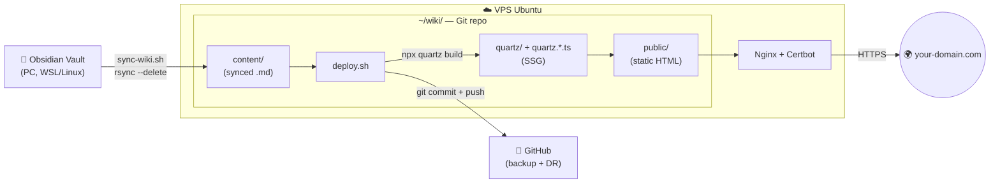

## Goal

Hi there!

Today I'm going to show you how I transformed the act of daily note-taking into a system that:

- helps me consolidate what I do during the day

- maps out arguments by showing their evolutions and ramifications

- automatically creates value not just for you, but for others too

The result is a personal, link-rich wiki to show off!

Here is what I actually do:

- I take notes with screenshots on my work latop, using OneNote

- At the end of the day I finalize them by converting them in Markdown, using [Obsidian](obsidian-setup).

- I push them to my VPS using a script

- As soon as they arrive, a static site is automatically generated using [Quartz](quartz-setup-linux), and everything is pushed to GitHub for backup.

This guide walks you through this entire pipeline.

***

## Architecture

The Obsidian vault lives on your PC, here is where you finalize the notes. 
A `sync-wiki.sh` script pushes them to the VPS via `rsync`, where `deploy.sh` turns them into static HTML using Quartz, and commits everything to GitHub. Nginx publishes the site via HTTPS. 



***

## 1. Install Obsidian on your PC

Follow [the Obsidian setup](obsidian-setup) to install Obsidian, create a vault, and learn the essentials (mainly wikilinks and tags, but also callouts and embeds).

The vault is just a normal folder on disk, so just pick a path you'll remember, for example:

`~/Documents/ObsidianVault` on Linux 

`C:\Users\you\Documents\ObsidianVault` on Windows (`/mnt/c/Users/you/Documents/ObsidianVault` from WSL).

***

## 2. Set up the VPS

Since my goal is to avoid vendor lock-in and keep everything fully open source, I use a Linux machine with a public IPv4 address. 
I host Nginx as my web server to publish my entire website on the domain _farnetiandrea.it_, which points directly to that IP address.

If you want to use the same setup, I recommend:

- A VPS with **Ubuntu 22.04+** (or any recent Debian-like distro)
- A non-root user with `sudo` privileges (the correct way to handle privileges in Linux)
- A public IPv4 address (e.g. `123.456.0.100`)
- A domain and its DNS pointed to the VPS (e.g. `wiki.yourdomain.com`--> `123.456.0.100`)
- [Nginx](nginx-web-server-setup) + [Certbot](certbot-setup-guide) for publishing the domain via HTTPS

***

## 3. Install Quartz on the VPS

Quartz is what converts your Markdown notes in a real site.

You can follow the [Quartz setup on Linux](quartz-setup-linux) for the detailed explanation. 

**TL;DR:** you want to clone Quartz in any folder that you want to use as the "container" for your site.

In my case, I host this Wiki in the folder "wiki" of my VPS, so i'll use that as a reference:
```bash
git clone https://github.com/jackyzha0/quartz.git wiki
cd wiki
rm -rf .git # remove the connection with the official Quartz upstream
git init # create a new Git repo
npm install
npx quartz build # it creates public/, the actual HMTL page of your website
```

Quartz will create the `content/` folder, and here's where we have to sync our markdown notes!

The content of the folder is what will be used to generate the website.

You can later also customize `quartz.config.ts` (title, colors, locale) and `quartz.layout.ts` (header, sidebar order) to make the webpage yours.

***

## 4. GitHub setup

Create a new empty repository on GitHub called `wiki` (no README, no license, leave it completely empty).

See "how to set up your first GitHub page", if you don't know the basics.

On your VPS:
```bash
cd ~/wiki
git add .
git commit -m "Initial commit"
git branch -M main
git remote add origin git@github.com:<your-username>/wiki.git
git push -u origin main
```

This is essential so that `deploy.sh`, the script that we'll later create for automating the process, can run `git push` without issues.

***

## 5. Configure Nginx

Nginx is the web-server that allows you to publish the site you just created with Quartz.

You can see a detailed explanation of Nginx and the configuration I use [here](nginx-web-server-setup).

**TL;DR:** you just need to point Nginx `root` at `~/wiki/public/`:
```nginx
server {
    server_name wiki.<YOUR_SITE.COM>;

    root /home/<YOUR_USER>/wiki/public; #points nginx to /public 
    index index.html;

    location / {
        try_files $uri $uri.html $uri/ =404;
    }
}
```

## 6. Setup Certbot

Certbot is the software that issues a certificate for your domain, so that it can run in HTTPS.

You can see the [Certbot setup guide](certbot-setup-guide) to install Certbot and activate it for you website.

**TL;DR:** it will add the following lines to your Nginx configuration:
```nginx
server {
    server_name wiki.<YOUR_SITE.COM>;

    root /home/<YOUR_USER>/wiki/public;
    index index.html;

    location / {
        try_files $uri $uri.html $uri/ =404;
    }

    listen 443 ssl; # managed by Certbot
    ssl_certificate     /etc/letsencrypt/live/wiki.farnetiandrea.it/fullchain.pem;
    ssl_certificate_key /etc/letsencrypt/live/wiki.farnetiandrea.it/privkey.pem;
    # …other Certbot directives…
}
``````

And... we are done!

Your personal Wiki should be online.

Now I'll show you a couple scripts to automate the pipeline process, so that you just need to worry about writing the notes and then sync, publish and back them up on GitHub with a click! 

## EXTRA. Automating the process

For automating the entire pipeline, we are going to need two scripts:

- `deploy.sh`: lives inside my "wiki" folder on the VPS. Deploys everything on GitHub and generates the site
- `sync-wiki.sh`: lives inside my work laptop. Syncs every note on the VPS and calls deploy.sh

`deploy.sh`:
```bash
#!/bin/bash
# Build Quartz, fix perms, push to GitHub as backup
set -euo pipefail
export NVM_DIR="$HOME/.nvm"
[ -s "$NVM_DIR/nvm.sh" ] && \. "$NVM_DIR/nvm.sh"

cd ~/wiki
npx quartz build
chmod -R o+rX public/

if [[ -n "$(git status --porcelain)" ]]; then
    git add .
    git commit -m "deploy: $(date -u +%Y-%m-%dT%H:%M:%SZ)"
    git push origin main
fi
```

`sync-wiki.sh`:
```bash
#!/bin/bash
# Sync vault to VPS, then deploy
set -euo pipefail

VAULT_LOCAL="/path/to/your/ObsidianVault/"   # trailing slash matters
VPS_ALIAS="my-vps"                            # from ~/.ssh/config
VPS_PATH="~/wiki/content/"

echo "==> [1/2] Sync vault to VPS..."
rsync -avz --delete \
  --chmod=F644,D755 \
  --exclude='.obsidian/' \
  --exclude='.trash/' \
  --exclude='.DS_Store' \
  --exclude='Thumbs.db' \
  -e "ssh" \
  "$VAULT_LOCAL" "$VPS_ALIAS:$VPS_PATH"

echo "==> [2/2] Trigger deploy on VPS..."
ssh "$VPS_ALIAS" "cd ~/wiki && ./deploy.sh"

echo "==> Done. Site live at https://wiki.yourdomain.com"
```

To correctly run this script, you also need to configure an SSH alias for your VPS.

Basically, an SSH alias let's you do:
```bash
ssh my-vps
```
Instead of :
```bash
ssh -i <PATH_TO_YOUR_SSHKEY> <NAME>@<IP>
```

To do that, you need to edit accordingly your `~/.ssh/config` in your [WSL](WSL-installation) installation:
```
Host my-vps
    HostName 1.2.3.4
    User myuser
    IdentityFile ~/.ssh/id_ed25519
```

Now we are finally ready to publish!

Open WSL in your work laptop, and launch:

```bash
./sync-wiki.sh
```

That's it. 

From now on, your daily workflow is the following:

1. Edit the final notes in Obsidian (fully offline).
2. When you want to publish them: `./sync-wiki.sh`.
3. Refresh your wiki: changes are live in a few seconds.

Vault → VPS → Quartz build → Nginx serves the site → GitHub gets a backup commit.
