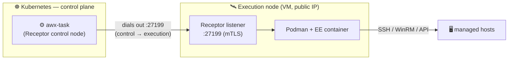

This page adds a **dedicated execution node**: a VM where playbooks actually run, joined to the AWX control plane over the **Receptor mesh**.

It's the jump from the Lab (jobs on the in-cluster default EE) to **pattern A**: execution isolated from the control plane, the way production AWX is run.

See [[my-awx-stack|the stack overview]] for the mesh architecture: this page builds it.

***

## Architecture



The control plane **dials out** to the execution node's listener.

In my case, I have to use a VPS for the execution node, so it has a public IP (an internal IP of course would be better): the mesh port is firewalled to the cluster's egress IP and secured by mTLS (certs issued by AWX's mesh CA).

Jobs assigned to this node run inside an EE container via Podman, fully isolated from the K8s control plane.

***

## Prerequisites

| Requirement | Notes |
|---|---|
| AWX running | From [[awx-operator-deploy\|the operator deploy]] |
| An execution-node VM | 2 vCPU / 4 GB / 40 GB, Ubuntu/Debian, **public IP** |
| **Podman** on the VM | The runtime that executes the EE container |
| The cluster's **egress IP** | To firewall the mesh port to the cluster only |

Find the cluster egress IP (the address the pods leave from):

```bash
kubectl run -n awx egress-check --rm -it --restart=Never \
  --image=curlimages/curl -- curl -s ifconfig.me ; echo
```

Note it as `<KAAS_EGRESS_IP>`: used in the firewall step.

***

## 1. Prepare the execution-node VM

Install Podman (the EE runtime) and Ansible (to run the install bundle):

```bash
sudo apt update
sudo apt install -y podman ansible-core
podman --version
```

> [!NOTE]
> On modern Debian/Ubuntu pip refuses system-wide installs. 
> 
> The install bundle pulls `ansible-runner` / `receptorctl` with pip and fails otherwise, so you have to allow it on this single-purpose node:
> ```bash
> sudo python3 -m pip config set --global global.break-system-packages true
> ```

> [!IMPORTANT] CA paths: the gotcha that breaks Debian/Ubuntu execution nodes 
> AWX mounts the host CA trust into the EE container using **RHEL paths** (`/etc/pki/ca-trust`, `/usr/share/pki`): on Debian/Ubuntu these don't exist, so Podman fails the mount and the job dies with `exit status 127` and **no output**. 
> 
> Create the paths and point the bundle at the Debian system CAs:
> ```bash
> sudo mkdir -p /etc/pki/ca-trust/extracted/pem /usr/share/pki
> sudo ln -sf /etc/ssl/certs/ca-certificates.crt \
>   /etc/pki/ca-trust/extracted/pem/tls-ca-bundle.pem
> ```
> (Or use a RHEL-family node to avoid this entirely)

Confirm the VM can pull the default EE image (public on Quay):

```bash
podman pull quay.io/ansible/awx-ee:latest
```

If that succeeds, the node can run jobs once the mesh is up.

***

## 2. Register the execution node in AWX

In the AWX UI (reached via your port-forward):

1. **Administration → Instances → Add**.
2. Fill in:
   - **Host Name**: the VM's **public IP** (how the control plane will reach it).
   - **Node Type**: `Execution`.
   - **Listener Port**: `27199`.
   - **Peers from control nodes**: **On**.
3. **Save**.

> [!IMPORTANT]
> **"Peers from control nodes" is mandatory:** The node is a passive listener, without this toggle the control plane never dials it and the instance stays **unavailable** forever, no matter how healthy the node is.

The instance appears with status **unavailable / pending**: expected, the node isn't running Receptor yet.

***

## 3. Install the mesh on the VM (download bundle)

AWX generates a per-node **install bundle** containing the Receptor config, the mTLS certificates signed by the mesh CA, and an Ansible playbook that wires everything up.

First, get the control plane's Receptor version, the node's Receptor **must match it** (not must, but should), or jobs dispatch, but could fail silently:

```bash
kubectl exec -n awx deploy/awx-task -c awx-task -- receptor --version
```

Then:

1. On the instance's detail page in AWX, click **Download Bundle** → you get a `.tar.gz`.
2. Copy it to the VM and extract:
   ```bash
   scp <instance>_install_bundle.tar.gz user@<VM-public-IP>:~/
   ssh user@<VM-public-IP>
   tar xzf <instance>_install_bundle.tar.gz && cd <instance>_install_bundle
   ```
3. Run the install playbook **on the node** (`-c local`), pinning the Receptor version to the control plane's:
   ```bash
   ansible-galaxy collection install -r requirements.yml
   ansible-playbook -i inventory.yml install_receptor.yml -c local \
     -e receptor_version=<control-plane-version>
   ```

> [!IMPORTANT]
> The bundle is **node-specific** (its certs only work for the hostname/IP you registered). If you re-create the instance in AWX, download a fresh bundle.

***

## 4. Firewall the mesh port

The control plane dials **into** `:27199`, so this rule is what makes the connection possible, and it must allow **only** the cluster:

```bash
# OS firewall (if ufw is active)
sudo ufw allow from <KAAS_EGRESS_IP>/32 to any port 27199 proto tcp
```

***

## 5. Verify the node is Ready

Back in **Administration → Instances**, the node flips to **Ready** within a minute once **both** the port is open (Step 4) **and** "Peers from control nodes" is on (Step 2), then the control plane dials out, the mTLS handshake succeeds, and the mesh is up.

On the VM you can confirm Receptor is connected:

```bash
sudo systemctl status receptor
sudo receptorctl --socket /run/receptor/receptor.sock status
# the node list must include the control plane (awx-task-...), not just itself
```

If the instance stays **unavailable**, the control plane can't reach the node: check that `<VM-public-IP>:27199` is reachable from the cluster egress (firewall, Security Group, "Peers from control nodes" enabled, and that the Host Name in AWX matches the VM's public IP).

***

## 6. Route jobs to the execution node

A Ready node does nothing until you send jobs to it, via an **Instance Group**:

1. **Administration → Instance Groups → Add → Create instance group**. Name it e.g. `execution-vms`.
2. Open the group → **Instances** tab → **Associate** → pick your execution node.
3. Open a Job Template (e.g. **Demo Job Template**) → **Edit** → set **Instance Groups** to `execution-vms` → **Save**.
4. **Launch** the template.

The job now runs on the VM, not on the in-cluster EE. 

Confirm it:

- The job output's **Details** pane shows the **Execution Node** = your VM.
- On the VM, `podman ps` during the run shows the ephemeral EE container executing the playbook.

That's pattern A: the control plane orchestrates, the dedicated node executes, isolated over the mesh.

***

## 7. Run a real job against a target host

The Demo Job ran a no-op against `localhost` *inside* the EE: it proved the **mesh**, not real automation. 

Now point the execution node at an actual machine. In my case, that's my VPS.

**The model:** AWX never does SSH to targets itself, the **execution node** does. 

The control plane dispatches the job, the node opens the SSH connection from *its own* IP and runs the playbook against the target.

```
Control plane (K8s)  →  execution node  →  SSH :22  →  target host (my VPS)
```

So you need three things: an SSH **credential**, an **inventory** with the host, and **connectivity** from the node to the target.

### 1. Credential: a dedicated SSH key

Generate a key just for AWX (don't reuse a personal one) and authorize it on the target:

```bash
# on your workstation
ssh-keygen -t ed25519 -f awx_target -C awx

# put the PUBLIC key on the target (or append awx_target.pub to its ~/.ssh/authorized_keys)
ssh-copy-id -i awx_target.pub <user>@<target>
```

In AWX: **Resources → Credentials → Add → type _Machine_** → set the **Username** and paste the **private key** (`awx_target`). 

AWX stores it encrypted in its vault.

### 2. Inventory: the target host

**Resources → Inventories → Add → Inventory** (e.g. `infra`), then:

**Hosts → Add** → the target's address.

> [!NOTE]
> If you have deployed [[gitlab-setup|Gitlab]] like i've shown you, you can save your Ansible inventories in GitLab and connect them to AWX *(tutorial coming soon)*

### 3. Connectivity: node → target:22

The SSH leaves from the **execution node's IP**, not the control plane, so:

- the target's firewall / Security Group must allow **:22 from the execution node's IP**
- the AWX public key must be in the target's `~/.ssh/authorized_keys`.

Verify straight from the node *before* bothering with launching a job:

```bash
ssh -i awx_target <user>@<target> "hostname"
```

If that returns the hostname, the job will work.

### 4. Job template: tie everything together 

**Resources → Templates → Add → Job Template**: pick the **inventory**, the **Machine credential**, a **playbook** (start with a one-line `ansible.builtin.ping`), and set **Instance Groups** to `execution-vms`., then **Launch** → Green means the node SSHed to the target and ran the play. 

That's real automation over the mesh.

***
## Scaling out

Adding more execution nodes is the same steps (prepare → register → bundle → firewall → associate), and they all join the same instance group. 

AWX load-balances jobs across the group. 

This is exactly how the pattern scales from one node to the dozens you'd find in a large real-world fleet: same shape, just multiplied.

***

## What you can do in the future

- Custom Execution Environments: build your own EE with `ansible-builder` and pull it on the execution nodes from the [[gitlab-setup|GitLab Registry]], instead of using the default public EE.
- **Production: external PostgreSQL**: when your environment allows a dedicated database host, move the DB out of the cluster, it is better for production. 