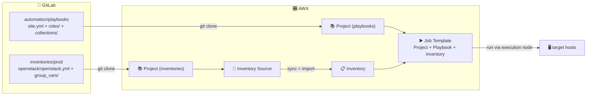

This guide wires [[gitlab-setup|GitLab]] into [[my-awx-stack|AWX]] so that **inventories, playbooks, roles and collections** all live in versioned, reviewable Git reposI. 

Git becomes the single source of truth: AWX just mirrors it. 

***

## The model: one mechanism, two consumers

A **Project** in AWX = a Git repo, cloned and kept in sync.

Its a **live link**, not a one-time import.

Basically, we can create a project that will contain our inventories, and another one for our playbooks, and link everything together to make it run. 



- **Job Templates** pick a **playbook** from inside a Project
- **Inventory Sources** pick an **inventory file** from a Project
- **roles / collections** come in through `requirements.yml`, automatically on Project sync.

> [!INFO]
> A green **Sync Status: Success** on an inventory, or a Job Template that just *has* a playbook dropdown, both mean the same thing underneath: a **Project** (Git) behind it.

***

## 1. GitLab: the repos

> [!note]- There are many other "layouts" you can use in GitLab....
> For example, the "all-in-one" playbook + inventory projects:
> 
> linux-hardening/ # project that contains both playbook and inventory 
> ├── ansible.cfg 
> ├── inventory.yml 
> ├── group_vars/ 
> │             └── hardened_servers.yml 
> ├── linux-hardening.yml
> 
> Down below I show you the layout I use for separating multiple environments (prod, test, dev...) 

First we have to create Groups:
![[Pasted image 20260604231839.png]]

This is my **Inventories** group, it contains **projects** organized per environment (prod, test, dev...), and every project contain its inventory file + `group_vars/` together.

For example:
```
inventories/prod # inventories is the group, prod is the project 
└── openstack/ # openstack is just a folder
    ├── openstack.yml # this is the inventory file 
    └── group_vars/all.yml # these are the group_vars
inventories/test
└── openstack/
...
```

> [!IMPORTANT]
> Keep `group_vars/` in the **same folder** as the inventory file, that's how Ansible (and AWX's import) auto-loads them.

This is my Automation group, it contains a **Playbooks** project, that contains many folders for dedicated playbooks, for example:
```
automation/playbooks
└── UpgradeHost/
	├── upgrade.yml
	├── roles/requirements.yml         # external roles (Galaxy or Git)
	└── collections/requirements.yml   # external collections
└── JoinAD/
...
```

***

## 2. GitLab: read-only SSH access (one credential for all repos)

AWX only needs to **clone**. 

To do that, we can use a **read-only service account** with a dedicated SSH key, member of every group: this way one credential can clone every repo.

Procedure:

1. **Bot user**: Admin → **Users → New user** → `svc-awx`.
   ![[Pasted image 20260604233205.png]]
2. **Read access**: each group (`inventories`, `automation`...) → **Manage → Members → Invite** → `svc-awx` → role **Reporter**.
   ![[Pasted image 20260604233359.png]]
3. **Create a SSH key**:
   ```bash
   ssh-keygen -t ed25519 -f svc-awx -C svc-awx -N ""
   ```
4. Admin → Users → `svc-awx` → **Impersonate** → **Preferences → SSH Keys** → paste `svc-awx.pub` → **Stop impersonation**.
   ![[Pasted image 20260604233557.png]]

> [!TIP]- Lighter alternative: an SSH deploy key (per-repo)
> Add the **public** key as a read-only **Deploy key** (Repo → Settings → Repository → Deploy keys, *Grant write permissions* OFF), and enable the same key on other repos. SSH too, just per-repo instead of group-wide.

Besides the key we just created for syncing projects and inventories, every target needs: 

- A **key for letting in the execution nodes via SSH** (that you will select later in AWX when running the playbook): the public half goes in the target's `~/.ssh/authorized_keys`, while the private half stays in every execution nodes.
  You can of course recycle it for every target: you just need to create it in a execution node, and do `ssh-copy-id -i awx_target.pub <user>@<target-ip>` (and of course you also need to put the private key inside every other execution node that you have).
- Every target allowing `:22` **from the execution node's IP** as source.

***

## 3. AWX: Source Control credential (SSH)

**Resources → Credentials → Add**
- **Credential Type**: `Source Control`
- **SCM Private Key**: the **private** `svc-awx` key
- Leave Username / Password / Passphrase **empty** (the user comes from the `git@` URL).
  
  ![[Pasted image 20260605000206.png]]

***

## 4. AWX: one Project per repo

Create a Project for **each** repo: same steps, different URL. 

**Resources → Projects → Add**:

| Field | Playbooks | Inventories |
|---|---|---|
| Name | `Playbooks` | `Inventories` |
| Source Control Type | Git | Git |
| Source Control URL | `git@gitlab.yourdomain.com:automation/playbooks.git` | `git@gitlab.yourdomain.com:inventories/prod.git` |
| Source Control Credential | `svc-awx` | `svc-awx` |
| Options | ✅ Update Revision on Launch | ✅ Update Revision on Launch |

For the Source Control URL, you have to copy the exact SSH URL from the GitLab repo's **Code → Clone with SSH**.

![[Pasted image 20260605000406.png]]

**Save** each, and wait for **Successful**. 

Ok, so now your AWX can see inventories and playbooks from your GitLab.

Now let's see how to actually put everything together in AWX: 

- Inventories in a inventory source
- Playbooks in a job template

And combine them to make everything work and run.

***

### Inventories → Inventory + Source

**Resources → Inventories → Add → Inventory** → Name → **Save** (this is just an empty container for now).

Now open it: **Sources** tab (appears only after saving) → **Add**:

| Field          | Value                                                                    |
| -------------- | ------------------------------------------------------------------------ |
| Source         | **Sourced from a Project**                                               |
| Project        | `Inventories`                                                            |
| Inventory file | `openstack/openstack.yml` (in this example) (not the same as screenshot) |
| Options        | ✅ Update on launch · ✅ Overwrite · ✅ Overwrite variables                 |
![[Pasted image 20260605000838.png]]

**Save → Sync**.

> [!BUG]- The "Inventory file" dropdown only shows `/ (project root)`
> AWX auto-lists inventory files at the **repo root**: files that are in **subfolders** often aren't suggested.
> 
> The field is **typeable**: just type your inventory path (in my example `openstack/openstack.yml`) relative to the repo root.

***

### Playbooks → Job Template

This is the main use of a Project.

**Resources → Templates → Add → Job Template**:

| Field               | Value                                          |
| ------------------- | ---------------------------------------------- |
| Name                | The name of the job Template                   |
| Job Type            | Run                                            |
| **Inventory**       | `OpenStack` (from the one we just created)     |
| **Project**         | `Playbooks`                                    |
| **Playbook**        | `playbookName.yml` *(dropdown, auto-detected)* |
| **Credentials**     | the **Machine** credential for the targets     |
| **Instance Groups** | `execution-vms` *(run on the execution node)*  |

**Save → Launch**. 

***

## Scaling out

Git stays the single source of truth, AWX has to mirror it:

- **playbooks** GitLab repo → AWX Project → create many **Job Templates**
- **inventories** GitLab repo → AWX Project → add many **Inventory Sources** (one per type: `openstack/`, `windows/`…)