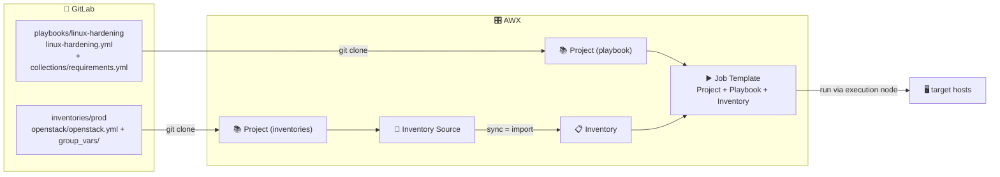

This guide wires [[gitlab-setup|GitLab]] into [[my-awx-stack|AWX]] so that **inventories, playbooks, roles and collections** all live in versioned, reviewable Git repos. 

Git becomes the single source of truth: AWX just mirrors it. 

***

## The model: one mechanism, two consumers

A **Project** in AWX = a Git repo, cloned and kept in sync.

Its a **live link**, not a one-time import.

Basically, we create one project per repo (some hold playbooks, some hold inventories) and link everything together to make it run.



- **Job Templates** pick a **playbook** from inside a Project
- **Inventory Sources** pick an **inventory file** from a Project
- **roles / collections** come in through `requirements.yml`, automatically on Project sync.

> [!INFO]
> A green **Sync Status: Success** on an inventory, or a Job Template that just *has* a playbook dropdown, both mean the same thing underneath: a **Project** (Git) behind it.

***

## 1. GitLab: the repos

> [!note]- There are many other "layouts" you can use in GitLab....
> For example, the "all-in-one" layout, one project with both playbook and inventory:
> 
> linux-hardening/ # project that contains both playbook and inventory 
> ├── ansible.cfg 
> ├── inventory.yml 
> ├── group_vars/ 
> │             └── hardened_servers.yml 
> ├── linux-hardening.yml
> 
> Down below I show the layout I use, which separates inventories (per environment) from playbooks (per automation).

First we have to create the Groups:
![[Pasted image 20260617161900.png]]

**Inventories group**: contains one **project per environment** (prod, test, dev...), and every project holds its inventory file + `group_vars/` together:
```
inventories/prod          # inventories is the group, prod is the project (repo)
└── openstack/            # openstack is just a folder (one per machine type)
    ├── openstack.yml      # the inventory file
    └── group_vars/
        └── all.yml        # the group_vars
inventories/test
└── openstack/
...
```

> [!IMPORTANT]
> Keep `group_vars/` in the **same folder** as the inventory file, that's how Ansible (and AWX's import) auto-loads them. The group a playbook targets (e.g. `hardened_servers`) and its variables also live **here, in the inventory** — not in the playbook repo.

**Playbooks group**: contains one **project per automation** (LinuxHardening, UpgradeHost, JoinAD...). Each repo is **flat**: the playbook, its `templates/`, and its `requirements.yml` files sit at the **repo root**, for example:
```
playbooks/linux-hardening   # playbooks is the group, linux-hardening is the project (repo)
├── linux-hardening.yml      # the playbook
├── collections/
│   └── requirements.yml     # external collections
└── templates/               # jinja2 templates the playbook uses
playbooks/upgrade-host
├── upgrade.yml
├── roles/requirements.yml   # external roles (only if the playbook uses any)
└── collections/requirements.yml
...
```

> [!IMPORTANT] requirements.yml must be at the repo root
> On Project sync, AWX runs `ansible-galaxy install` reading **only** the root-level `roles/requirements.yml` and `collections/requirements.yml`. 
> 
> Files in **subfolders are not picked up**: that's why each automation is its **own repo** with the requirements at its root (the playbook itself can sit in a subfolder, the requirements can't).

***

## 2. GitLab: read-only SSH access (one credential for all repos)

AWX only needs to **clone**. 

To do that, we can use a **read-only service account** with a dedicated SSH key, member of every group: this way one credential can clone every repo.

Procedure:

1. **Bot user**: Admin → **Users → New user** → `svc-awx`.
   ![[Pasted image 20260604233205.png]]
2. **Read access**: each group (`inventories`, `Playbooks`...) → **Manage → Members → Invite** → `svc-awx` → role **Reporter**.
   ![[Pasted image 20260604233359.png]]
3. **Create a SSH key**:
   ```bash
   ssh-keygen -t ed25519 -f svc-awx -C svc-awx -N ""
   ```
4. Admin → Users → `svc-awx` → **Impersonate** → **Preferences → SSH Keys** → paste `svc-awx.pub` → **Stop impersonation**.
   ![[Pasted image 20260604233557.png]]

> [!TIP]- Lighter alternative: an SSH deploy key (per-repo)
> Add the **public** key as a read-only **Deploy key** (Repo → Settings → Repository → Deploy keys, *Grant write permissions* OFF), and enable the same key on other repos. SSH too, just per-repo instead of group-wide.

Besides the key we just created for syncing projects and inventories, every target needs: 

- A **key for AWX to reach the targets via SSH** (you select it later as a **Machine credential** when running the playbook): we set it up [[awx-execution-nodes#7. Run a real job against a target host|here]]. Recap: the **public** half goes in every target's `~/.ssh/authorized_keys`; the **private** half goes into the **AWX Machine credential**: AWX injects it into whichever execution node runs the job (it's never stored on the nodes).
- Every target allowing `:22` **from the execution node's IP** as source.

***

## 3. AWX: Source Control credential (SSH)

**Resources → Credentials → Add**
- **Credential Type**: `Source Control`
- **SCM Private Key**: the **private** `svc-awx` key
- Leave Username / Password / Passphrase **empty** (the user comes from the `git@` URL).
  
  ![[Pasted image 20260605000206.png]]

***

## 4. AWX: one Project per repo

As I said, we need to create a Project for **each** repo: same steps, different URL. 

**Resources → Projects → Add**:

| Field | Playbook | Inventories |
|---|---|---|
| Name | `LinuxHardening` | `Inventories` |
| Source Control Type | Git | Git |
| Source Control URL | `git@gitlab.yourdomain.com:playbooks/linux-hardening.git` | `git@gitlab.yourdomain.com:inventories/prod.git` |
| Source Control Credential | `svc-awx` | `svc-awx` |
| Options | ✅ Update Revision on Launch | ✅ Update Revision on Launch |

For the Source Control URL, copy the exact SSH URL from the GitLab repo's **Code → Clone with SSH**.

![[Pasted image 20260605000406.png]]

**Save** each, and wait for **Successful**. On the playbook project sync, check the log shows `ansible-galaxy` installing your collections: that confirms the root-level `collections/requirements.yml` was picked up.

Now AWX can see your inventories and playbooks... Let's put them together!

- Inventories → an **Inventory Source**
- Playbooks → a **Job Template**

***

### Inventories → Inventory + Source

**Resources → Inventories → Add → Inventory** → Name → **Save** (this is just an empty container for now).

Now open it: **Sources** tab (appears only after saving) → **Add**:

| Field          | Value                                                     |
| -------------- | -------------------------------------------------------- |
| Source         | **Sourced from a Project**                              |
| Project        | `Inventories`                                            |
| Inventory file | `openstack/openstack.yml` (in this example)             |
| Options        | ✅ Update on launch · ✅ Overwrite · ✅ Overwrite variables |
![[Pasted image 20260605000838.png]]

**Save → Sync**.

> [!BUG]- The "Inventory file" dropdown only shows `/ (project root)`
> AWX auto-lists inventory files at the **repo root**: files in **subfolders** often aren't suggested.
> The field is **typeable**: just type your inventory path (e.g. `openstack/openstack.yml`) relative to the repo root.

> [!NOTE]
> Variables from `group_vars/all.yml` are imported as **inventory-level** variables (Inventory → Variables), not onto each host — but they still apply to every host at runtime.

***

### Playbooks → Job Template

This is the main use of a Project.

**Resources → Templates → Add → Job Template**:

| Field                     | Value                                                          |
| ------------------------- | ------------------------------------------------------------- |
| Name                      | e.g. `LinuxHardening`                                         |
| Job Type                  | **Check** for a dry-run, then **Run**                        |
| **Inventory**             | the inventory that holds the target group                    |
| **Project**               | `LinuxHardening`                                              |
| **Playbook**              | `linux-hardening.yml` *(dropdown; subfolders are listed too)* |
| **Execution Environment** | leave **default** *(it's an image, not a machine)*           |
| **Credentials**           | the **Machine** credential for the targets                   |
| **Instance Groups**       | `execution-vms` *(the execution node that SSHes to the target)* |

**Save → Launch**. 

> [!WARNING] Execution Environment ≠ Execution Node
> Two similarly-named things:
> - **Execution Environment** = the *container image* the job runs in → leave it on the **default** (`awx-ee`). Don't pick "Control Plane Execution Environment" (that's the internal image for control-plane tasks).
> - **Execution Node** = the *machine* (VM) that runs the job and opens the SSH to the target → you choose it via **Instance Groups → `execution-vms`**.

> [!TIP]
> Run a **dry-run first**: set **Job Type → Check** (+ **Show Changes** for the diff), read the diff, then switch to **Run**. Essential for anything touching SSH / PAM / firewall.

***

## Scaling out

Git stays the single source of truth, AWX mirrors it:

- **Playbooks** group → one repo per automation → one AWX **Project** each → its **Job Template(s)**
- **inventories** group → one repo per environment → AWX **Project** → many **Inventory Sources** (one per type: `openstack/`, `windows/`…)
- **roles / collections** → `requirements.yml` at each repo root → installed automatically on sync