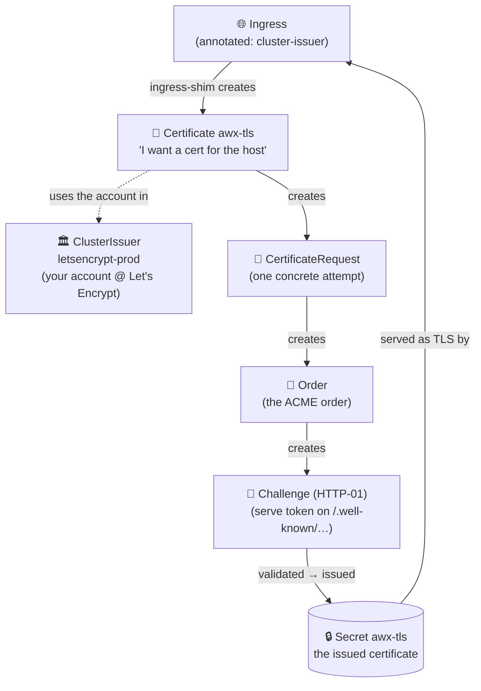

So far AWX is reached via `kubectl port-forward`: fine to bootstrap, useless as a real service.
This page gives it a proper public address (`awx.farnetiandrea.it`) over **HTTPS**, with an auto-renewing Let's Encrypt certificate, using **ingress-nginx** + **cert-manager** wired through the AWX CR.

See [[my-awx-stack|the stack overview]] for where this sits in the architecture.

***

## Prerequisites

| Requirement | Notes |
|---|---|
| AWX running | From [[awx-operator-deploy\|the operator deploy]] |
| A **DNS name** you control | A subdomain like `awx.example.com` (I use `awx.farnetiandrea.it`) |
| KaaS **LoadBalancer** support | The ingress controller needs an external IP: most managed K8s provision one |

***

## 1. Install the ingress controller

`ingress-nginx` is the reverse proxy that terminates HTTP(S) and routes to the AWX service. 

On a KaaS, it requests a **LoadBalancer** with a public IP:

```bash
kubectl apply -f https://raw.githubusercontent.com/kubernetes/ingress-nginx/controller-v1.11.2/deploy/static/provider/cloud/deploy.yaml

# Wait for the controller, then read the public IP it got:
kubectl get svc -n ingress-nginx ingress-nginx-controller -w
```

The `EXTERNAL-IP` column is your public entrypoint.

> [!NOTE]
> `EXTERNAL-IP` usually stays `<pending>` for **~1-2 minutes** while the KaaS attaches a public IP to the LoadBalancer (it pulls one from your cloud panel **Elastic IPs**).

> [!WARNING]
> If it's **still `<pending>` after ~5 minutes**, your KaaS isn't auto-provisioning a LoadBalancer. Check your cloud panel for a managed LB / a way to attach a public IP to `LoadBalancer` services.

***

## 2. Point DNS at the ingress

Create an **A record** for your hostname pointing at the `EXTERNAL-IP` from Step 1:

```
awx.example.com.   A   <EXTERNAL-IP>
```

Verify it resolves before continuing (DNS propagation can take a few minutes):

```bash
dig +short awx.example.com
# must return <EXTERNAL-IP>
```

***

## 3. Install cert-manager and a Let's Encrypt issuer

**cert-manager** watches Ingress resources and auto-provisions/renews TLS certificates. 

Install it, then create a cluster-wide Let's Encrypt issuer:

```bash
kubectl apply -f https://github.com/cert-manager/cert-manager/releases/download/v1.15.3/cert-manager.yaml

# Wait for the three cert-manager pods to be Running:
kubectl get pods -n cert-manager -w
```

Create the issuer (set your real email, Let's Encrypt uses it for expiry notices):

```bash
kubectl apply -f - <<'EOF'
apiVersion: cert-manager.io/v1
kind: ClusterIssuer
metadata:
  name: letsencrypt-prod
spec:
  acme:
    server: https://acme-v02.api.letsencrypt.org/directory
    email: you@example.com
    privateKeySecretRef:
      name: letsencrypt-prod
    solvers:
      - http01:
          ingress:
            class: nginx
EOF
```

> [!INFO]
> The **HTTP-01** challenge proves you own the domain by serving a token over `http://awx.example.com/.well-known/...` through the ingress: that's why Steps 1–2 (ingress + DNS) must work first.

Verify it has been created correctly:

```bash
kubectl get clusterissuer letsencrypt-prod -w
# wait for READY=True (~30s)
```

> [!BUG]- ClusterIssuer `READY=False`: "account does not exist"
> The `privateKeySecretRef` secret holds a **stale ACME account key** (a half-finished first registration). Delete it so cert-manager re-registers a fresh account:
>
> ```bash
> kubectl delete secret -n cert-manager letsencrypt-prod
> kubectl get clusterissuer letsencrypt-prod -w # → READY=True
> ```

### How cert-manager works

cert-manager turns that **one annotation** into a real certificate through a **chain of objects**. 

You don't create them by hand: each one creates the next. 

Knowing the chain is the whole debugging trick: when the cert is stuck, you walk it top-to-bottom and `describe` the link that's stuck.



| Resource               | What it is                                                                                                     | Inspect it                              |
| ---------------------- | -------------------------------------------------------------------------------------------------------------- | --------------------------------------- |
| **ClusterIssuer**      | Your **account** with Let's Encrypt (automatically created). Must be `READY=True` or nothing downstream works. | `kubectl get clusterissuer`             |
| **Certificate**        | The declaration *"I want a cert for `awx.example.com`, store it in secret `awx-tls`"*.                         | `kubectl get certificate -n awx`        |
| **CertificateRequest** | One concrete signing attempt for that Certificate.                                                             | `kubectl get certificaterequest -n awx` |
| **Order**              | The order opened at Let's Encrypt (ACME).                                                                      | `kubectl get order -n awx`              |
| **Challenge**          | The proof of ownership (HTTP-01: serve a token). The step that usually gets stuck.                             | `kubectl get challenge -n awx`          |
| **Secret `awx-tls`**   | The **issued certificate** + key. The Ingress reads it to serve HTTPS.                                         | `kubectl get secret -n awx awx-tls`     |

> [!TIP]
> **Debugging rule:** walk the chain from the top. Whatever is `READY=False` / `pending`, `describe` it and read the `Reason:` / `Message:`, it tells you exactly the broken link.
> ```bash
> kubectl describe clusterissuer letsencrypt-prod
> kubectl describe certificate -n awx awx-tls
> kubectl describe challenge -n awx <challenge-name>
> ...
> ```

---
## 4. Switch the AWX CR to Ingress

Edit `~/awx-deploy/awx-instance.yaml`, replace `service_type: ClusterIP` with the ingress config:

```yaml
apiVersion: awx.ansible.com/v1beta1
kind: AWX
metadata:
  name: awx
  namespace: awx
spec:
  postgres_configuration_secret: awx-postgres-configuration
  # ── Public exposure ──────────────────────────────────
  ingress_type: ingress
  ingress_class_name: nginx
  hostname: awx.example.com # replace with your site
  ingress_tls_secret: awx-tls
  # cert-manager reads this annotation off the Ingress and issues the cert
  ingress_annotations: |
    cert-manager.io/cluster-issuer: letsencrypt-prod
```

Re-apply:

```bash
kubectl apply -k ~/awx-deploy
```

The operator now creates an `Ingress` (with the cert-manager annotation): cert-manager sees it and starts the issuance chain below.

***

## 5. Verify

```bash
# The Ingress exists and has your host
kubectl get ingress -n awx

# The certificate goes READY=True once issued (can take ~1-2 min)
kubectl get certificate -n awx -w
# NAME      READY   SECRET    AGE
# awx-tls   True    awx-tls   45s

# End-to-end
curl -I https://awx.example.com
# HTTP/2 200 … with a valid Let's Encrypt cert
```

Open https://awx.example.com: you can stop using `kubectl port-forward` now.

> [!BUG]- Challenge stuck `pending`
> `describe challenge` shows: `failed to perform self check … context deadline exceeded`, yet `curl http://awx.example.com` **from outside responds**.
>
> The cause: cert-manager (a pod *inside* the cluster) can't reach the cluster's **own public LoadBalancer IP** (some managed KaaS don't hairpin the external IP back in), so cert-manager won't proceed until its self-check passes.
>
> **Fix**: make cert-manager resolve the hostname to the ingress's *internal* IP, via a `hostAlias` on its pod:
>
> ```bash
> # 1. Internal ClusterIP of the ingress controller
> kubectl get svc -n ingress-nginx ingress-nginx-controller # CLUSTER-IP column
>
> # 2. Add it as a hostAlias on the cert-manager deployment
> kubectl -n cert-manager patch deployment cert-manager --type merge -p '{"spec":{"template":{"spec":{"hostAliases":[{"ip":"<ingress-CLUSTER-IP>","hostnames":["awx.example.com"]}]}}}}'
>
> # 3. Force a fresh challenge with the updated pod
> kubectl delete certificaterequest -n awx --all
> kubectl get certificate -n awx -w # → True
> ```
> You could also try to fix this by editing the **CoreDNS** configmap directly, but providers of a managed KaaS usually **reconcile it back** to default within seconds, so the change won't stick.

***

## 6. Lock it down

AWX is now on the public internet: protected by its login, but the login page is exposed. 

Two layers worth adding:

- **Strong auth**: keep the random admin password in your [[bitwarden-setup|vault]], and add LDAP auth when more people use it.
- **Source-IP allowlist** (if only you/your VPS need access): restrict at the ingress so the login page isn't even reachable from elsewhere:
  ```yaml
  ingress_annotations: |
    cert-manager.io/cluster-issuer: letsencrypt-prod
    nginx.ingress.kubernetes.io/whitelist-source-range: "<your-ip>/32,<vps-ip>/32"
  ```

> [!WARNING]
> Restrict **:443** (the UI), but keep **:80** reachable from the internet: At renewal (~every 60 days) Let's Encrypt re-validates over `:80` from *its* servers, if you block it the renewal fails (the internal self-check passes thanks to the hostAlias, but LE's real check is external).