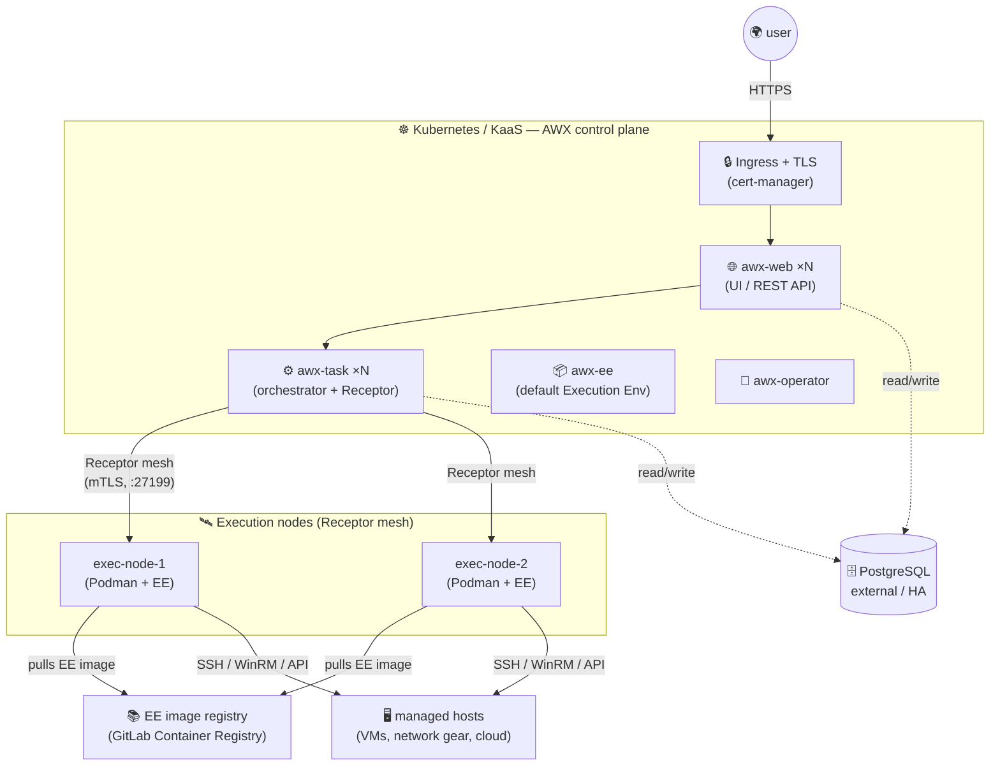

![[Pasted image 20260602180612.png]]

There's a deprecated quickstart version of AWX that every tutorial stops at: a `docker-compose up` on a single host. 

It works for ten minutes and falls over the moment you treat it as real.

So, this is the **other** version: AWX deployed the way it's actually run in production environments. 

- The **AWX Operator on Kubernetes** as the control plane
- An **external, dedicated PostgreSQL** instead of the throwaway pod (*TBA*).
- Dedicated **execution nodes** joined over a **Receptor mesh**, so playbooks run isolated from the control plane
- Custom **Execution Environments** built in CI and pulled from my own [[gitlab-setup|GitLab Container Registry]] (*TBA*).

***

## Why Kubernetes-only

> [!IMPORTANT]
> Forget every old tutorial using `docker-compose`. 
> Since **AWX 18 (2021)** the only supported install method is the **AWX Operator on Kubernetes**. The native/Docker installer is end-of-life. The question "how do I deploy AWX" has become "what Kubernetes do I run it on, and how do I configure the operator".

The **AWX Operator** is a Kubernetes operator: you give it a custom resource (`kind: AWX`) describing the deployment you want, and it reconciles the cluster to match, creating the web pods, task pods, services, and (optionally) a database pod. 

Upgrades, scaling, and backups are all driven by editing custom resources.

***

## Architecture

The AWX control plane lives in our Kubernetes worker nodes. 

The actual playbook execution happens on dedicated execution node VMs. 

The database and EE registry are external services.

***

## Core components

| Component           | What it does                                                                                                      | Where it runs                                                |
| ------------------- | ----------------------------------------------------------------------------------------------------------------- | ------------------------------------------------------------ |
| **awx-operator**    | Reconciles the `AWX` custom resource into the running deployment                                                  | K8s (operator namespace)                                     |
| **awx-web**         | Serves the UI and REST API. Stateless → scale horizontally                                                        | K8s pods (×N)                                                |
| **awx-task**        | The orchestrator: schedules jobs, dispatches work over the Receptor mesh, runs the task queue                     | K8s pods (×N)                                                |
| **awx-ee**          | The default Execution Environment: runs jobs *inside the cluster* when no separate execution nodes are configured | K8s pod                                                      |
| **PostgreSQL**      | Stores everything: inventories, job history, encrypted credentials, RBAC                                          | **External** (not the operator's managed pod, in production) |
| **Execution nodes** | Where playbooks actually run, isolated from the control plane, joined via Receptor                                | Dedicated VMs                                                |
| **EE registry**     | Hosts the container images jobs run inside                                                                        | External (e.g. GitLab Registry)                              |

***

## The Receptor mesh

This is the piece that confuses most newcomers. 

**Receptor** is the overlay network that connects the AWX control plane to the execution nodes.

The control plane (`awx-task`) doesn't SSH into your servers directly, it dispatches a *work unit* over the Receptor mesh to an execution node, which runs the playbook and streams the result back.

Nodes in the mesh have one of three roles:

| Node type | Role |
|---|---|
| **Control** | The `awx-task` pods. Originate work, hold the job queue. |
| **Execution** | Run the playbooks (via Podman, inside an EE container). The actual workers. |
| **Hop** | Optional relay nodes that bridge network segments (DMZ, remote sites, NAT) so the control plane never needs a direct route to every execution node. |

> [!INFO]
> In a small deployment the mesh is **flat**, the control plane connects directly to each execution node: Hop nodes only become necessary when execution nodes live behind network boundaries the control plane can't reach directly.

***

## Execution Environments

An **Execution Environment (EE)** is a **container image** that bundles everything a playbook needs to run.

You build it with **`ansible-builder`** (a declarative `execution-environment.yml` → a container image), push it to a **registry**, and AWX pulls it on each execution node at job time. 

The playbook runs *inside* that container, isolated from the host.

> [!TIP]
> This is where the [[gitlab-setup|self-hosted GitLab]] guide pays off: build your EE images in **GitLab CI** with `ansible-builder`, push them to the **GitLab Container Registry**, and have AWX pull from there.

***

## Two execution patterns

A core architectural decision that drives your K8s cluster sizing:

|                | **A: AWX Control-plane-only on K8s cluster**                                  | **B: Everything on K8s cluster**    |
| -------------- | ----------------------------------------------------------------------------- | ----------------------------------- |
| Where jobs run | Dedicated **execution nodes** (VMs) via Receptor mesh                         | As **pods** inside the K8s cluster  |
| Isolation      | Strong                                                                        | Weak                                |
| Scaling        | Add execution-node VMs independently of the cluster                           | Add K8s worker nodes / bigger nodes |
| Network reach  | Execution nodes can sit close to the targets (low latency, clean firewalling) | All egress from the cluster         |
| Complexity     | One more layer (the mesh) to set up                                           | Simpler: nothing outside K8s        |
| Best for       | Production, multi-site, many targets                                          | Lab or small companies              |

Pattern **A** is the production standard (and the one used in large real-world deployments). 

Pattern **B** is the right starting point for a Lab.

...we are going for A.

***

## Sizing the worker nodes

The AWX control plane itself is light (~5 vCPU / ~12 GB of requests across the cluster in HA). 

What you provision depends on the execution pattern above.

| Pattern                      | Worker nodes (starting point)               |
| ---------------------------- | ------------------------------------------- |
| **A (Control-plane-only)**   | **3 × (4 vCPU / 8 GB RAM / 60–80 GB disk)** |
| **B (On-cluster execution)** | **3 × (4 vCPU / 16 GB RAM)**                |

> [!WARNING] Warning: The floor is 3 worker nodes 
> One node = no HA (any maintenance is a full outage). 
> 
> Two nodes = you can run replicas, but a single node failure or drain leaves zero headroom.
> 
> Three nodes is the production minimum: lose one, the other two carry the load, and you get real anti-affinity for the `awx-web` / `awx-task` replicas.

For a production-minded build that mirrors the large-scale pattern, the recommended shape is: **3 KaaS worker nodes (4 vCPU / 8 GB)** for the control plane, **1–2 execution-node VMs** added separately, and an **external PostgreSQL**.
