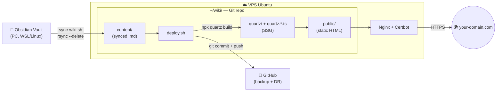

## Goal

Build a personal, link-rich wiki where:
- You write notes in **Obsidian** on your laptop (instant feedback, graph view, plugins).
- A single command publishes them as a fast static site under your domain.
- GitHub keeps a backup for disaster recovery.

This guide stitches together [[The ultimate Obsidian setup! - Installation & Configuration|Obsidian]] + [[Quartz setup on Linux|Quartz]] into a complete pipeline.

***

## 🏗️ Architecture

The Obsidian vault lives on your PC. A `sync-wiki.sh` script pushes it to the VPS via `rsync`, where `deploy.sh` turns it into static HTML with Quartz. Nginx serves the files. GitHub stores a backup for disaster recovery.



***

## Step 1 — Install Obsidian on your PC

Follow [[The ultimate Obsidian setup! - Installation & Configuration]] to install Obsidian, create a vault, and learn the essentials (wikilinks, tags, callouts, frontmatter).

The vault is just a normal folder on disk — pick a path you'll remember (e.g. `~/Documents/ObsidianVault` on Linux/macOS, `C:\Users\you\Documents\ObsidianVault` on Windows, accessible from WSL as `/mnt/c/Users/you/Documents/ObsidianVault`).

***

## Step 2 — Set up the VPS

You need:
- **Ubuntu 22.04+** (or any recent Debian-like distro)
- A non-root user with `sudo`
- A domain pointing to the VPS (e.g. `wiki.yourdomain.com`)
- **Nginx** + **Certbot** already configured for the domain

***

## Step 3 — Install Quartz on the VPS

Follow [[Quartz setup on Linux]] to install Node.js 22, clone Quartz, run `npm install`, and verify with a first `npx quartz build`. Point Nginx `root` at `~/wiki/public/`.

Customize `quartz.config.ts` (title, colors, locale) and `quartz.layout.ts` (header, sidebar order) to make it yours.

***

## Step 4 — Create `deploy.sh` on the VPS

Inside `~/wiki`:

```bash
#!/bin/bash
# Build Quartz, fix perms, push to GitHub as backup
set -euo pipefail
export NVM_DIR="$HOME/.nvm"
[ -s "$NVM_DIR/nvm.sh" ] && \. "$NVM_DIR/nvm.sh"

cd ~/wiki
npx quartz build
chmod -R o+rX public/

if [[ -n "$(git status --porcelain)" ]]; then
    git add .
    git commit -m "deploy: $(date -u +%Y-%m-%dT%H:%M:%SZ)"
    git push origin main
fi
```

Make it executable:

```bash
chmod +x deploy.sh
```

***

## Step 5 — Create `sync-wiki.sh` on your PC

This is the script that ties everything together: rsync the vault to the VPS, then trigger `deploy.sh` over SSH.

```bash
#!/bin/bash
# Sync vault to VPS, then deploy
set -euo pipefail

VAULT_LOCAL="/path/to/your/ObsidianVault/"   # trailing slash matters
VPS_ALIAS="my-vps"                            # from ~/.ssh/config
VPS_PATH="~/wiki/content/"

echo "==> [1/2] Sync vault to VPS..."
rsync -avz --delete \
  --chmod=F644,D755 \
  --exclude='.obsidian/' \
  --exclude='.trash/' \
  --exclude='.DS_Store' \
  --exclude='Thumbs.db' \
  -e "ssh" \
  "$VAULT_LOCAL" "$VPS_ALIAS:$VPS_PATH"

echo "==> [2/2] Trigger deploy on VPS..."
ssh "$VPS_ALIAS" "cd ~/wiki && ./deploy.sh"

echo "==> Done. Site live at https://wiki.yourdomain.com"
```

Configure the SSH alias in `~/.ssh/config`:

```
Host my-vps
    HostName 1.2.3.4
    User myuser
    IdentityFile ~/.ssh/id_ed25519
```

***

## Step 6 — Publish

```bash
./sync-wiki.sh
```

That's it. Vault → VPS → Quartz build → Nginx serves the site → GitHub gets a backup commit.

***

## Daily workflow

1. Edit notes in Obsidian (any time, fully offline).
2. When you want to publish: `./sync-wiki.sh`.
3. Refresh your wiki URL — changes are live in a few seconds.

***

## Why this setup?

| Aspect | Why this choice |
|---|---|
| **Obsidian** | Best-in-class local editing, graph view, no lock-in (notes are plain `.md`) |
| **Quartz** | Static site, fast, native support for Obsidian wikilinks / callouts / embeds |
| **Plain rsync** | No vendor, no daemons, dead-simple, works over SSH |
| **VPS + Nginx** | Full control, no platform limits, cheap |
| **GitHub backup** | Free off-site copy + commit history, useful for disaster recovery |