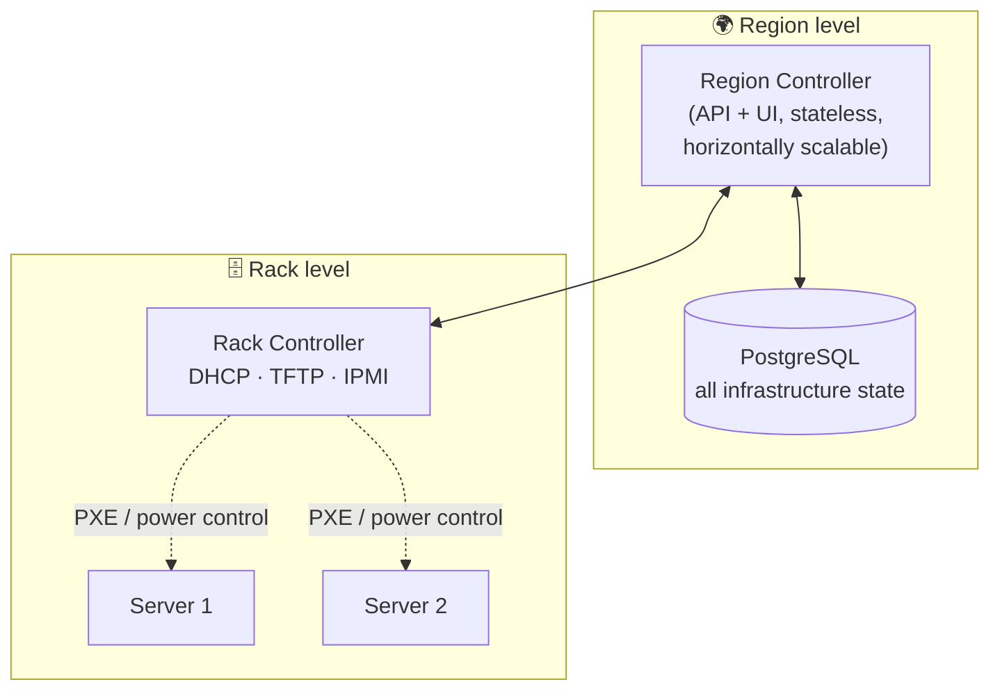

![[Pasted image 20260707183120.png]]

> [!quote] Credits
> This guide is based on the excellent hands-on article [MAAS - Metal as a Service](https://www.overflowjournal.it/maas-metal-as-a-service/) by Lorenzo Comotti (Overflow Journal), reworked and condensed for this wiki.

## Why MAAS?

Virtual machines give you instant flexibility — but some workloads still demand **physical servers**: raw performance, data locality/security requirements, or simply long-term cost control at scale.

The pain with bare metal has always been the manual ceremony: walk to the rack (or open the BMC console), mount an ISO, install the OS, partition the disks, configure the network, repeat for every single box. It doesn't scale past a handful of machines.

**MAAS (Metal as a Service)**, by Canonical, turns that ceremony into an API call: it discovers physical servers over the network, inventories their hardware, and deploys operating systems on them — PXE boot, disk layout, network config, SSH keys, everything — from a single control panel. Think of it as *an intelligent control panel for your datacenter*: bare-metal hardware managed with the same fluidity as a cloud.

***

## Architecture

MAAS is built from three components:



| Component             | Role                                                                                                                                                   |
| --------------------- | ------------------------------------------------------------------------------------------------------------------------------------------------------ |
| **PostgreSQL**        | Stores *all* infrastructure state: machines, networks, images, users.                                                                                  |
| **Region Controller** | The brain: API, web UI, coordination across the whole region. Stateless → scales horizontally.                                                          |
| **Rack Controller**   | The hands: lives close to the machines, provides the network services deployment needs (DHCP, TFTP for PXE, IPMI power control) and talks to the region. |

> [!tip] Why the region/rack split matters
> Rack controllers only need visibility of *their own* rack's networks. The region controller never has to reach every management network in the datacenter — each rack controller acts locally on its own scope. Smaller blast radius, cleaner security perimeter.

In a **standalone installation** (this guide) a single host wears both hats: it is region *and* rack controller at once. You'll see both roles listed under the *Controllers* section of the UI.

***

## Prerequisites

Minimum resources for a standalone install:

| Resource | Minimum                       |
| -------- | ----------------------------- |
| CPU      | 4 cores                       |
| RAM      | 8 GB                          |
| Disk     | 20 GB                         |
| NIC      | 1 (2 if you manage IPMI too)  |
| OS       | Linux — Ubuntu recommended    |
| Network  | Internet access (image sync)  |

You should be comfortable with **bash** and **Layer 2 networking** concepts (VLANs, broadcast domains) — MAAS is all about L2 visibility.

The lab used throughout this guide:

- MAAS host: a VM with 8 vCPU / 16 GB RAM / 50 GB SSD, Ubuntu 24.04 LTS
- 2 NICs: one on the **management** network (`10.100.129.0/24`), one on the **IPMI** network (`10.100.130.0/24`)
- Target hardware: a Dell PowerEdge R640

***

## Phase 1 — Installation

Start from a fully updated system:

```bash
sudo apt update
sudo apt dist-upgrade -y
sudo reboot
```

MAAS installs either via **snap** or via **APT**.

> [!warning] Pick ONE method
> Snap **or** APT — never both. Installing through both channels causes package conflicts and hard-to-debug malfunctions.

Via snap:

```bash
sudo snap install --channel=3.7/stable maas
```

*(🖼️ Screenshot — snap install output)*

Or via APT:

```bash
sudo apt-add-repository ppa:maas/3.7
sudo apt update
sudo apt -y install maas
```

*(🖼️ Screenshot — apt install output)*

This guide uses **3.7**; check [Canonical's docs](https://maas.io/docs) for the currently supported versions.

**PostgreSQL** is installed and wired up automatically. For production you'd want it in high availability, but for a standalone lab the bundled instance is fine.

*(🖼️ Screenshot — PostgreSQL setup during install)*

Create the admin user:

```bash
sudo maas createadmin --username=$PROFILE --email=$EMAIL_ADDRESS
```

*(🖼️ Screenshot — createadmin prompts)*

Then point a browser at the server IP on port **5240**:

```
http://<maas-ip>:5240/MAAS
```

*(🖼️ Screenshot — MAAS web UI login/dashboard)*

***

## Phase 2 — Initial configuration

### Region name and DNS

The first-run wizard asks for a **region name** and the **DNS servers** MAAS will hand to managed machines. The lab uses `overflowjournal` as region name and Google DNS.

*(🖼️ Screenshot — region + DNS configuration screen)*

### OS images

Select which OS images MAAS should import. **Ubuntu 24.04 LTS** is proposed by default; more can be added at any time.

*(🖼️ Screenshot — image selection screen)*

### SSH key

> [!warning] No key, no access
> If you don't configure a public SSH key here, you will **not** be able to log into the servers MAAS deploys. The key gets injected into every deployed OS.

Import your personal public key (from file, GitHub or Launchpad).

*(🖼️ Screenshot — SSH key import)*

*(🖼️ Screenshot — Controllers section showing the standalone host in both region+rack roles)*

***

## Phase 3 — Prepare the first environment

### Pool

**Pools** group machines logically — useful to split environments (prod/staging, customer A/B) and filter searches. Create one for your environment (the lab: `overflowjournal`).

*(🖼️ Screenshot — pool creation dialog)*

### Domain

MAAS ships with the **`.maas`** zone as default. Add your own domain if you want machines to receive a proper FQDN at deploy time — the lab adds `overflowjournal.it` as an **authoritative** domain (DNS managed directly by MAAS).

*(🖼️ Screenshot — Add domain dialog)*

### Network objects

Before touching the UI, learn the four MAAS network primitives:

| Object     | What it is                                                                                                          |
| ---------- | -------------------------------------------------------------------------------------------------------------------- |
| **Fabric** | A logical container for networks belonging to the same physical infrastructure (e.g. a "VMware" or "OpenStack" fabric). Holds VLAN+subnet combinations. |
| **Space**  | A *functional* grouping of subnets: "management", "backend", "ipmi"...                                              |
| **Subnet** | An IP network. Always attached to exactly one VLAN.                                                                  |
| **VLAN**   | The L2 segment (VID). Belongs to a fabric.                                                                            |

> [!important] L2 visibility is everything
> The rack controller must have **Layer 2 visibility** on the target servers' management network *and* on their IPMI network. If PXE broadcast frames can't reach the rack controller, nothing downstream works.

MAAS auto-discovers the subnets its NICs sit on — they appear under generic names (`fabric-0`, `fabric-1`). Rename everything to something meaningful:

- `fabric-0` → `overflowjournal-management`
- `fabric-1` → `overflowjournal-ipmi`
- Create two **spaces**: `management` and `ipmi`
- Rename the subnets: `10.100.129.0/24` → `overflowjournal-management`, `10.100.130.0/24` → `overflowjournal-ipmi`
- On each fabric, take the **untagged VLAN**, rename it and assign it to its space

*(🖼️ Screenshots — subnets list with fabric-0/fabric-1, fabric rename dialogs, space creation, subnet rename, VLAN configuration — one per step)*

### DHCP

PXE boot needs DHCP: the machine being provisioned gets a **temporary IP** from MAAS to communicate during enlistment and deploy.

> [!warning] Check the range twice
> Make sure the DHCP range you reserve is genuinely **free**. Overlapping with an existing DHCP server or with statically-assigned IPs on the same segment means conflicts that are painful to debug.

On the management VLAN: *Configure DHCP* → select the rack controller that will serve it → define the temporary IP range. Repeat on the IPMI VLAN.

*(🖼️ Screenshots — Configure DHCP button, DHCP settings dialog with rack controller + range, resulting VLAN summary)*

***

## Phase 4 — Prepare the physical server

Example hardware: **Dell PowerEdge R640** (any IPMI-capable server works the same way).

> [!important] Switch ports
> The NIC used for PXE boot must be on the same L2 segment as the rack controller's management network. Verify the switch port configuration (VLAN, no port security blocking DHCP) *before* blaming MAAS.

### BIOS settings

1. Enter the BIOS (`F2` on Dell) — *(🖼️ Screenshot — BIOS access)*
2. **Boot mode → UEFI** (required by modern OS versions) — *(🖼️ Screenshot — UEFI setting)*
3. Check the **storage** layout — the lab presents 2 RAID volumes — *(🖼️ Screenshot — RAID config)*
4. **Enable PXE boot** on the management NIC — *(🖼️ Screenshot — PXE enablement)*

Reboot and pick PXE from the boot menu (`F12` on Dell).

*(🖼️ Screenshot — PXE boot menu + DHCP address acquisition)*

The server gets a temporary DHCP lease, boots the MAAS enlistment image, registers itself, **powers off automatically**, and appears in the *Machines* section.

*(🖼️ Screenshot — machine appearing in the Machines list)*

### Enrich the machine in MAAS

Select the machine → set a proper **name** and DNS domain, and assign it to the **pool** created earlier (Configuration tab).

*(🖼️ Screenshot — machine configuration tab with pool assignment)*

### Commissioning

Commissioning is the diagnostic pass: MAAS powers the machine on, boots an ephemeral image, builds a full **hardware profile** (CPU, RAM, disks, NICs, BIOS details) and runs functional tests. On success the machine lands in the **Ready** state.

*(🖼️ Screenshots — commissioning running, machine in Ready state)*

### Network layout

The *Network* tab lists every NIC with link state (red = no carrier; connected ports show negotiated speed). The lab server has two live 10 Gbps interfaces, `eno1np0` and `eno2np1`.

Here you can build **bonds, bridges, VLANs** — the full production network layout, applied at deploy time. The lab keeps it simple: static IP on `eno1np0`, second NIC left unconfigured.

*(🖼️ Screenshots — Network tab, static IP configuration on eno1np0)*

### Storage layout

The two RAID volumes appear as two disks:

- Disk 1: `/boot/efi` + root (`/`)
- Disk 2: formatted **XFS**, mounted at `/mnt/disk1`

> [!warning] Verify the boot disk
> Check which disk carries the *boot* flag: MAAS may auto-select the wrong one and happily install the OS on the wrong volume. Fix it via **"Set boot disk..."** if needed.

*(🖼️ Screenshots — storage tab with both disks, partition layout, Set boot disk option)*

***

## Phase 5 — Deploy the OS

Everything is staged — hit **Deploy**, pick **Ubuntu 24.04 LTS**, confirm.

*(🖼️ Screenshots — Deploy dialog with OS selection)*

> [!note]
> The deploy can take several minutes — the actual duration depends on the bandwidth between MAAS and the target server (image transfer + install + first boot).

When it finishes, the machine shows **Deployed**.

*(🖼️ Screenshot — machine in Deployed state)*

### Verify

SSH into the machine (with the key imported in Phase 2) and check that hostname, network layout and storage match what you configured in MAAS:

```bash
ssh ubuntu@<server-ip>
hostname --fqdn
ip -br a
lsblk -f
```

*(🖼️ Screenshot — SSH session on the deployed server)*

***

## Closing thoughts

One server, provisioned end-to-end without ever mounting an ISO. But the real value shows up at scale: the exact same flow runs **in parallel on dozens of machines** — enlistment, commissioning, deploy — from one panel, with one consistent configuration.

What you gain:

- **Time**: no per-server manual installs
- **Consistency**: every machine deployed from the same recipe (goodbye snowflakes)
- **Fewer human errors**: disk layouts and network configs are declared once, applied by machine
- **A cloud-like workflow on your own iron**: Ready machines are a pool you allocate on demand

Bare metal, minus the ceremony.