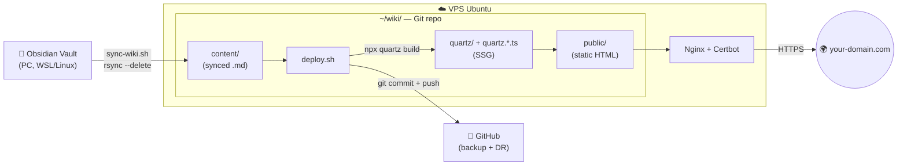

Hi there!

Today I'm going to show you how I transformed the act of daily note-taking into a system that:

- helps me consolidate what I do during the day

- maps out arguments by showing their evolutions and ramifications

- automatically creates value not just for you, but for others too

The result is a personal, link-rich wiki to show off!

Here is what I actually do:

- I take notes with screenshots on my work latop, using OneNote

- At the end of the day I finalize them by converting them in [Markdown](markdown-guide), using [Obsidian](obsidian-setup).

- I push them to my VPS using a Python script

- As soon as they arrive, a static site is automatically generated using [Quartz](quartz-setup-linux.md), and everything is pushed to [GitHub](github-101) for backup, using [Git](git-basics) for versioning.

This guide walks you through this entire pipeline.

***

## Architecture

The Obsidian vault lives on your PC, here is where you finalize the notes. 
A `sync-wiki.sh` script pushes them to the VPS via `rsync`, where `deploy.sh` turns them into static HTML using Quartz, and commits everything to GitHub. Nginx publishes the site via HTTPS. 



***

## Deployment
###  <input type="checkbox"> 1. Install Obsidian on your PC

Follow [[obsidian-setup#Installation|the Obsidian setup]] to install Obsidian, create a vault, and learn the essentials (mainly wikilinks and tags, but also callouts and embeds).

The vault is just a normal folder on disk, so just pick a path you'll remember, for example:

`~/Documents/ObsidianVault` on Linux 

`C:\Users\you\Documents\ObsidianVault` on Windows (`/mnt/c/Users/you/Documents/ObsidianVault` from WSL).

***

### <input type="checkbox"> 2. Set up your VPS

Since my goal is to avoid vendor lock-in and keep everything fully open source, I use a Linux machine with a public IPv4 address. 
I host Nginx as my web server to publish my entire website on the domain _farnetiandrea.it_, which points directly to that IP address.

If you want to use the same setup, I recommend:

- A VPS with **Ubuntu 22.04+** (or any recent Debian-like distro)
- A non-root user with `sudo` privileges (the correct way to handle privileges in Linux)
- A public IPv4 address (e.g. `123.456.0.100`)
- A [domain and its DNS](DNS-domains.md) pointed to the VPS (e.g. `wiki.yourdomain.com`--> `123.456.0.100`)
- [Nginx](nginx-web-server-setup.md) + [Certbot](certbot-setup-guide.md) for publishing the domain via HTTPS

***

###  <input type="checkbox"> 3. Install Quartz on the VPS

Quartz is what converts your Markdown notes into a real site.

You can follow the [[quartz-setup-linux#Installation (Ubuntu/Debian)|Quartz setup on Linux]] for the detailed explanation. 

> [!tldr] TL;DR:
> You need to clone the Quartz repository in the directory that you want to use as the "container" for your site.
>I host this Wiki in the `~/wiki` directory of my VPS, so i'll use that as a reference throughout the guide

```bash
git clone https://github.com/jackyzha0/quartz.git wiki
cd wiki
rm -rf .git # remove the connection with the official Quartz upstream
git init # create a new Git repo
npm install
npx quartz build # it creates public/, the actual HMTL page of your website
```

Quartz will create the `content/` folder, and here's where we have to sync our markdown notes!

You can later also customize `quartz.config.ts` (title, colors, locale) and `quartz.layout.ts` (header, sidebar order) to make the webpage yours.

***

###  <input type="checkbox"> 4. Git & GitHub setup

Now, create a new empty repository on GitHub called `wiki` (no README, no license, leave it completely empty).

See [[github-101#Create your first repository|how to set up your first GitHub page]], if you don't know the basics.

So after we created our dedicated GitHub page for our project, we are ready to link it with our `~/wiki` local repo, by adding the remote origin:
![[git-basics#^first-push]]

This is essential so that `deploy.sh`, the script that we'll create for automating the process, can run `git push` without issues.

***

###  <input type="checkbox"> 5. Configure Nginx

Nginx is the web-server that allows you to publish the site you just created with Quartz.

You can see a detailed explanation of Nginx and the configuration I use [here](nginx-web-server-setup.md).

> [!tldr] TL;DR:
 >You just need to point Nginx `root` at `~/wiki/public/`

![[nginx-web-server-setup#^basic-conf]]

So in our case `server_name ...` will be something like `server_name wiki.<YOUR_SITE.COM>;`
and `root /var/www/example;` will be like `root /home/<YOUR_USER>/wiki/public;`


***

###  <input type="checkbox"> 6. Certbot Installation

Certbot is the software that issues a certificate for your domain, so that it can run in HTTPS.

You can see the [Certbot setup guide](certbot-setup-guide.md) to install Certbot and activate it for you website.

>[!tldr] TL;DR:
> It will issue a certificate and add the following lines to your Nginx configuration:

![[certbot-setup-guide#^basic-conf]]

For example, this is how my final nginx vhost kinda looks like:
> [!example]- Example: wiki.farnetiandrea.it
> ```nginx
> server {
>     server_name wiki.farnetiandrea.it;
>     root ~/wiki/public;
>     index index.html;
>     location / { try_files $uri $uri.html $uri/ =404; }
> 
>     listen [::]:443 ssl;            # managed by Certbot
>     listen 443 ssl;                 # managed by Certbot
>     ssl_certificate     /etc/letsencrypt/live/wiki.farnetiandrea.it/fullchain.pem;
>     ssl_certificate_key /etc/letsencrypt/live/wiki.farnetiandrea.it/privkey.pem;
>     include /etc/letsencrypt/options-ssl-nginx.conf;
>     ssl_dhparam /etc/letsencrypt/ssl-dhparams.pem;
> }
> 
> server {
>     if ($host = wiki.farnetiandrea.it) {
>         return 301 https://$host$request_uri;
>     }
>     listen 80;
>     listen [::]:80;
>     server_name wiki.farnetiandrea.it;
>     return 404;
> }
> ```

And... we are done!

Your personal Wiki should be online.

Now I'll show you a couple scripts to automate the pipeline process, so that you just need to worry about writing the notes and then sync, publish and back them up on GitHub with a click! 

***

###  <input type="checkbox"> 7. Automating the process

For automating the entire pipeline, we are going to need two scripts:

- `deploy.sh`: lives inside my "wiki" folder on the VPS. Deploys everything on GitHub and generates the site
- `sync-wiki.sh`: lives inside my work laptop. Syncs every note on the VPS and calls deploy.sh (to be used via [[WSL-installation|WSL]], of course)

`deploy.sh`:
```bash
#!/bin/bash
# Build Quartz, fix perms, push to GitHub as backup
set -euo pipefail
export NVM_DIR="$HOME/.nvm"
[ -s "$NVM_DIR/nvm.sh" ] && \. "$NVM_DIR/nvm.sh"

cd ~/wiki
npx quartz build
chmod -R o+rX public/

if [[ -n "$(git status --porcelain)" ]]; then
    git add .
    git commit -m "deploy: $(date -u +%Y-%m-%dT%H:%M:%SZ)"
    git push origin main
fi
```

`sync-wiki.sh`:
```bash
#!/bin/bash
# Sync vault to VPS, then deploy
set -euo pipefail

VAULT_LOCAL="/path/to/your/ObsidianVault/"   # trailing slash matters
VPS_ALIAS="my-vps"                            # from ~/.ssh/config
VPS_PATH="~/wiki/content/"

echo "==> [1/2] Sync vault to VPS..."
rsync -avz --delete \
  --chmod=F644,D755 \
  --exclude='.obsidian/' \
  --exclude='.trash/' \
  --exclude='.DS_Store' \
  --exclude='Thumbs.db' \
  -e "ssh" \
  "$VAULT_LOCAL" "$VPS_ALIAS:$VPS_PATH"

echo "==> [2/2] Trigger deploy on VPS..."
ssh "$VPS_ALIAS" "cd ~/wiki && ./deploy.sh"

echo "==> Done. Site live at https://wiki.yourdomain.com"
```

To correctly run this script, you also need to configure an SSH alias for your VPS (its not mandatory of course, you can just edit `ssh "$VPS_ALIAS"` with the full `ssh -i <PATH_TO_YOUR_SSHKEY> <NAME>@<IP>` command).

Basically, an SSH alias let's you do:
```bash
ssh my-vps
```
Instead of :
```bash
ssh -i <PATH_TO_YOUR_SSHKEY> <NAME>@<IP>
```

To do that, you need to edit accordingly your `~/.ssh/config` in your [WSL](WSL-installation) installation:
```
Host my-vps
    HostName 1.2.3.4
    User myuser
    IdentityFile ~/.ssh/id_ed25519
```

Now we are finally ready to publish!

Open WSL in your work laptop, and launch:

```bash
./sync-wiki.sh
```

That's it. 

From now on, your daily workflow is the following:

1. Edit the final notes in Obsidian (fully offline).
2. When you want to publish them: `./sync-wiki.sh`.
3. Refresh your wiki: changes are live in a few seconds.

***
## EXTRA: Work from another PC

If you want to edit the wiki from more than one machine (e.g. work laptop + your home desktop), you don't need a fancy sync setup. 

Since you're the only writer, the simplest rules are: **always run `sync-wiki.sh` before switching machines**, and **always pull from the other side**. As long as the active PC has pushed its work to GitHub, the second one can just pull the latest `content/` and resume.

Here's a recap of what you need to do for bootstrapping a new PC.
### 1. Prerequisites

1. **WSL** installed and working.
2. **SSH key for connecting to the VPS**: the same key works for both, but you can generate a second one if you prefer. If you do, copy its public key to the VPS with `ssh-copy-id username@your-vps-ip` (or paste it manually into `~/.ssh/authorized_keys` on the VPS).
3. **SSH alias** for the VPS in `~/.ssh/config` (inside WSL):
   ```
   Host my-vps
       HostName <YOUR_VPS_IP>
       User <YOUR_VPS_USER>
       IdentityFile ~/.ssh/id_ed25519
   ```
4. **Git** installed in WSL (`sudo apt install git`).
5. **Obsidian** installed on Windows.

### 2. Setup

Once the prerequisites are in place:

1. **Clone the wiki repo** somewhere convenient in WSL:
   ```bash
   git clone git@github.com:<YOUR_USER>/wiki.git ~/wiki-local
   ```
2. **Copy `content/` into your Obsidian Vault folder**:
   ```bash
   mkdir -p "/mnt/c/Users/<YOUR_USER>/Documents/Obsidian Vault"
   
   rsync -av --exclude='.obsidian/' ~/wiki-source/content/ \
   "/mnt/c/Users/<WIN_USER>/Documents/Obsidian Vault/"
   ```
3. **Copy `sync-wiki.sh`** from the first PC (or rewrite it from scratch — it's only ~20 lines, see the section above). The only things that change between PCs are the local paths and possibly the SSH alias.
4. **Open Obsidian** → *Open another vault* → select the `Obsidian Vault` folder you just populated.

The new PC is now ready to use exactly like the first one.

### 3. Daily workflow

> [!DANGER]
> From now on, you have to manually handle the sync state in every local Obsidian vault!
>
> This means that, whenever you start working on a PC after editing from another one, the first thing you must do **before making any changes** is to **pull the latest state from GitHub**, so your local vault reflects whatever was last pushed from the other PC.
> You must also **always push your changes to GitHub before leaving a PC** (`./sync-wiki.sh`): this way, if you move to another machine, it will be in an up-to-date state, after pulling.

For pulling (first thing you do):
```bash
cd ~/wiki-source # if you deleted it you need to clone it again
git fetch origin && git reset --hard origin/main

rsync -av --delete --exclude='.obsidian/' \
  ~/wiki-source/content/ \
  "/mnt/c/Users/<WIN_USER>/Documents/Obsidian Vault/"
```

For pushing (last thing you do):
```bash

./sync-wiki.sh

```

***
## Where to go next

Great, so now you have your VPS hosting your personal wiki on your domain... but how do we make it (or any website in general) **resilient**?

For a high-level overview (not a step-by-step walkthrough, since it depends on the site itself), you can check out my [[website-resilience|website resilience]] guide and go from there.

And what can you build next?
  
If this is your first step into building your own homelab, a [metrics](my-grafana-stack) and [[my-elk-stack|logging]] stack is probably the next thing to do. Go on and check out my guides!