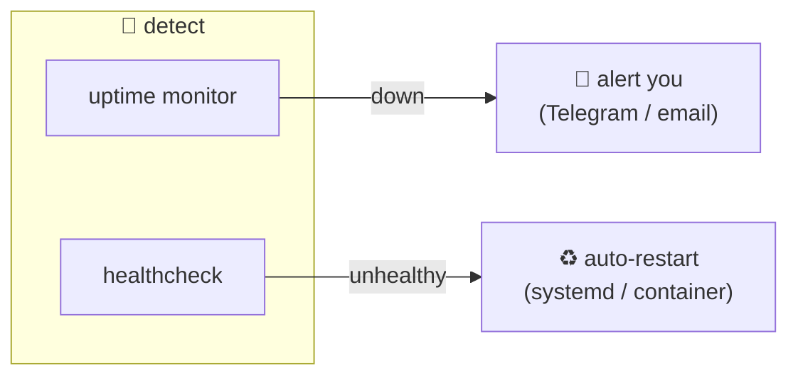
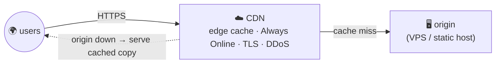
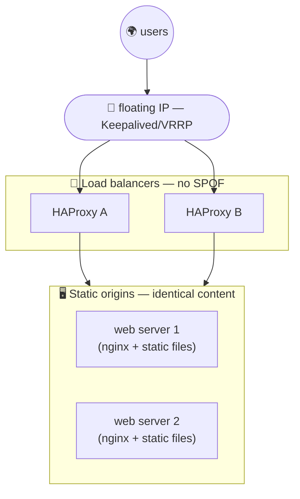
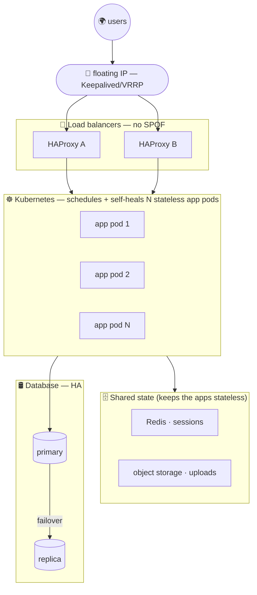

We've already covered the classic HA building blocks on their own: 

- [[haproxy|HAProxy]]: a load balancer that spreads traffic across backends and drops the dead ones
- [[keepalived-vrrp|Keepalived / VRRP]]: a floating IP that fails over between two nodes, so the load balancer itself isn't a single point of failure. 

But a load balancer in front of **one** web server still isn't enough the moment that server (or the box under it) dies. 

This page zooms out: how to make an actual *site* resilient end to end.

It comes down to two levers: 

- **Detection + self-healing**: notice a failure within seconds and try to recover automatically (restart, failover, serve from cache).
- **Remove single points of failure (SPOFs)**: no single host or component whose death takes the whole site down (CDN, replicas, DB failover, resilient DNS).

How far you push depends on whether the site is **static** (easy) or **dynamic** (hard), and on how critical it really is.

***

## Detection + Self-Healing

The cheapest, highest-ROI layer: applies whether the site is static or dynamic.

* **External uptime monitoring + alerting** ([UptimeRobot](https://uptimerobot.com), [Healthchecks.io](https://healthchecks.io)...): know within a minute, and route the alert somewhere you'll actually see (email, Telegram...)
* **Service auto-restart**: systemd `Restart=on-failure`, containers `restart: unless-stopped`.
* **Health checks**: nginx up, app `/healthz`, Docker `HEALTHCHECK`, so the platform can detect a sick instance and restart it
* **[[certbot-setup-guide|TLS auto-renew]]** (`certbot.timer`) so the certificate never silently expires
* **Resource guards**: disk-space alerts + log rotation (a full disk takes sites down quietly)
* **Backups + *tested* restore**: content, config and data (a restore you've never tried isn't a backup)

***

## Remove SPOFs

### Static sites

A static site has **no server-side state**... so you can easily cache and replicate it anywhere. 

This is the cheapest path to real HA.

* **CDN in front** (e.g. [Cloudflare](https://www.cloudflare.com), free): edge caching "Always Online" (serves a cached copy if the origin is down), anycast/resilient DNS, TLS at the edge, DDoS protection, hidden origin IP. The single biggest win for a static site.
* **Static hosting** ([Cloudflare Pages](https://pages.cloudflare.com), [GitHub Pages](https://pages.github.com)...): the site's uptime stops depending on any one host.
* **Multi-origin** (if you stay self-hosted): two or more servers serving the same content, with DNS failover or load balancing with [[keepalived-vrrp|keepalived/VRRP]].

***

### Dynamic sites

A dynamic site is an application that has **state** (database, sessions, uploads...), so HA means making **each layer** redundant, not just the front end.

* **Orchestration**: this is where **[Kubernetes](https://kubernetes.io)** (or [Docker Swarm](https://docs.docker.com/engine/swarm/)) earns its keep by scheduling replicas across nodes and self-healing (overkill for a *static* site, of course)
* **Load balancer must not itself be a SPOF**: two LBs with [[keepalived-vrrp|keepalived/VRRP]].
* **Database HA**: primary + replica with **automatic failover** plus backups with a tested restore.
* **HA of the application itself**: it's the program that generates the site dynamically per request (reads the DB and renders the HTML). Just to make an example, in my domain I host a [Grafana](https://grafana.com) installation, that uses Go and Node to generate the dynamic UI.