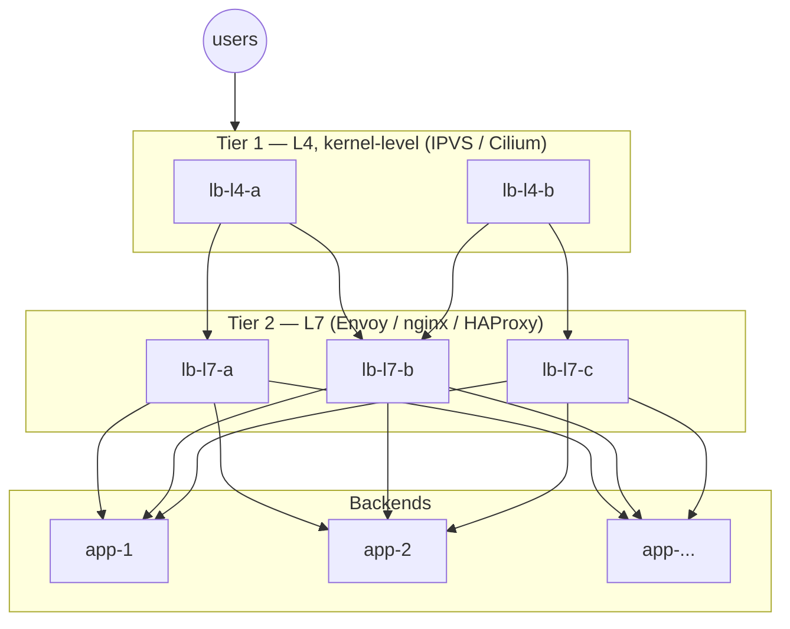

You have one server and too many users. 

Easy fix: put **5 servers** behind a **load balancer**. 

...But wait, now all those users talk to a single endpoint again: the load balancer itself. 

Haven't we just recreated the exact same problem one hop earlier?

**Yes. And that's the honest answer**: you don't *eliminate* the bottleneck, you **move** it. 

The whole game of scaling is moving the bottleneck to a layer that:

1. Does **less work** per request
2. Can itself be **scaled horizontally** more easily than the layer below

A load balancer is exactly that. 

And when *it* saturates, you move the bottleneck again, up to a point where the "front door" isn't a machine anymore, but the network itself.

***

## Why the LB holds much more than your App server

The reason why a single LB can front 5 (or 50) app servers without breaking a sweat:

| Layer                                                    | Work done per request                                                  | Relative cost |
| -------------------------------------------------------- | ---------------------------------------------------------------------- | ------------- |
| **App server**                                           | TLS, parsing, business logic, DB queries, template rendering           | 💥💥💥💥      |
| **L7 load balancer** (nginx, HAProxy `mode http`, Envoy) | TLS termination, HTTP parsing, routing on path/header, sticky sessions | 💥💥          |
| **L4 load balancer** (HAProxy `mode tcp`, LVS/IPVS)      | Forwarding connections as opaque bytes, no parsing at all              | 💥            |

An L4 balancer moves packets, your app server *thinks*. 

Same hardware, orders of magnitude more requests per second.

The L4 vs L7 trade-off in practice (with configs) is covered in [[haproxy#3. TCP vs HTTP mode|HAProxy: TCP vs HTTP mode]].

***

## But when the LB saturates too...

Sooner or later a single balancer hits its ceiling (bandwidth, packets-per-second, TLS handshakes).

What do we do?

There are two ways out:

- **Build**: you can implement some (or all) of the solutions below yourself, depending on the size of your application and your goals.
- **Buy**: you can put a CDN in front. **A CDN is basically all the solutions, sold as a service**: with Cloudflare in front of your site (as I shown in [[website-resilience]]) you're *renting* their anycast announcements, their multi-tier balancing, their globally distributed edge. You get the endgame architecture from day one... they just own it instead of you.

If you're building, here they are, from the baseline everyone starts with, up to planet scale:

### 0. Keepalived / VRRP: HA, *not* scaling

The classic first move: two LB nodes sharing a **Virtual IP**, active/standby failover via VRRP.

Careful though: this solves a **different problem**. It removes the single point of *failure*, not the single point of *throughput*: at any moment, still exactly **one** node carries all the traffic. It's the availability baseline every serious setup starts from, and it composes with everything below.

Full guide: [[keepalived-vrrp|here]].

### 1. DNS round-robin / GSLB

Instead of publishing one LB IP, publish **N records** for the same name, each pointing to an independent LB (or LB pair):

```
app.example.com.  A  203.0.113.10   ← LB cluster 1
app.example.com.  A  203.0.113.20   ← LB cluster 2
app.example.com.  A  203.0.113.30   ← LB cluster 3
```

Clients spread across the records: each LB cluster only sees a slice of the traffic. 

**GSLB** (Global Server Load Balancing) is the smarter version: the DNS answer depends on the client's geography or on health checks, steering users to the nearest/healthiest site.

"But isn't DNS the new single endpoint?" Technically yes, and the bottleneck has moved again: onto a system that is *massively* distributed by design (resolver caching, TTLs, anycast DNS providers), exactly the point of the game.

> [!warning] The trade-off
> DNS has no instant failover: a dead LB keeps receiving traffic until client/resolver caches expire (TTL). GSLB with health checks + short TTLs mitigates, but never eliminates.

### 2. Multi-tier load balancing

Split the balancing itself into layers, each doing less work than the one below:



- **Tier 1 (L4)**: dumb, kernel-fast connection spreading. Almost impossible to saturate on CPU.
- **Tier 2 (L7)**: TLS, routing, retries: the smart stuff, horizontally scaled because tier 1 spreads load across it.
- **Backends**: your actual app.

Each tier scales independently. 

This is the shape you'll find inside any serious Kubernetes ingress or cloud provider's own LB service.

### 3. BGP with anycast + ECMP

The endgame: rough sketch only, because it deserves its own page once we cover BGP properly.

The idea: the **same IP address** is announced via **BGP** from multiple datacenters at once (*anycast*). The internet's routing itself delivers each user to the topologically nearest site. Within a site, **ECMP** (Equal-Cost Multi-Path) lets routers spray flows across multiple LB nodes that all claim the same IP.

The consequence is the conceptual finish line: **there is no front-door machine anymore**: the "load balancer" is the routing fabric of the network itself, the same trick behind `8.8.8.8`.
