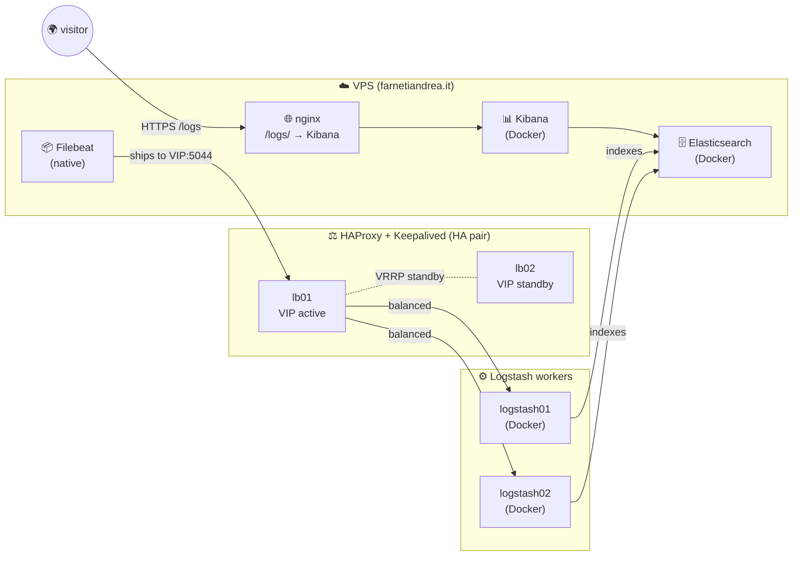

![[Pasted image 20260522152449.png]]

[farnetiandrea.it/logs](https://farnetiandrea.it/logs)

## What is the ELK Stack?

The **ELK Stack** is the open-source ecosystem for centralised logging, maintained by Elastic and the broader community.

The acronym covers three components:
- **E**: **Elasticsearch**: a distributed search engine + document database optimised for logs and time-series text events.
- **L**: **Logstash**: an event-processing pipeline (input → filter → output).
- **K**: **Kibana**: the web UI that queries Elasticsearch and renders dashboards.

In modern deployments a fourth piece is almost always added: **Filebeat**, the lightweight log shipper that lives on every source machine and pushes events into the pipeline. The combination is sometimes called the **Elastic Stack** to underline that Beats are first-class citizens, not an add-on.

## Architecture

All traffic between the VPS and the 4 VMs runs on a private LAN: the VMs have no public ports exposed.

## The stack I use

| Role               | Tool                  | Where it runs                   | What it does                                                                          |
| ------------------ | --------------------- | ------------------------------- | ------------------------------------------------------------------------------------- |
| Log shipper        | **Filebeat**          | on the VPS (native)             | reads `/var/log/*`, `journalctl`, Docker logs; ships to the HAProxy VIP on `:5044`    |
| Load-balancing     | **HAProxy + Keepalived** | lb01 + lb02 (HA pair)        | active/standby VIP, TCP-mode load balance to the Logstash pool                        |
| Parsing pipeline   | **Logstash**          | logstash01 + logstash02 (Docker) | parses, enriches, and ships parsed events to Elasticsearch                            |
| Storage + search   | **Elasticsearch**     | on the VPS (Docker)             | indexes events, runs queries, retains data with ILM policy                            |
| Visualisation      | **Kibana**            | on the VPS (Docker)             | UI for Discover / Visualize / Dashboard; exposed publicly via nginx on `/logs/`       |

## Why this topology?

Because it mirrors a real, scalable, enterprise pattern for production.

The three layers each solve one specific problem:

- **HAProxy + Keepalived HA pair**: smooths traffic spikes, hides individual Logstash nodes from the shippers, lets you do rolling upgrades / restarts on Logstash without losing events, and isolates failures (a crashed LS doesn't affect Filebeat).
- **Multiple Logstash workers**: parsing is CPU-heavy. Two identical workers double the throughput, and if one dies the load balancer just stops sending events to it.
- **Single Elasticsearch**: this is the only simplification, but it can work fine like this for most cases.

## Deployment order

This series walks the components in **deploy order**, which for a push-based pipeline like ELK runs **opposite to the data flow**: the consumer side has to exist before the producer has anywhere to push to! 

From the receiving end backwards:

1. **Elasticsearch**: the DB. Once this is up and queryable, everything else has somewhere to send events.

2. **Kibana**: the UI. Connected to ES, exposed via nginx.

3. **Logstash workers**: the parsers. One minimal pipeline (beats input → ES output) is enough.

4. **HAProxy + Keepalived**: the Load Balancer layer. Two LBs, active/standby VIP with failover.

5. **Filebeat**: the log shipper. Targets the LB VIP directly.

Each step has its own page in this series. 

Hit *Start the series* below and you'll be walked through one piece at a time.

## Scaling beyond this lab

> [!TIP] What changes when you have 2000+ machines
> The same shape, just multiplied:
>
> - **More Logstash workers** behind the same LB pair: HAProxy's `balance roundrobin` scales horizontally for free until you saturate the LB itself.
> - **Multiple LB pairs** geographically distributed, often with DNS round-robin in front, when one VIP can't handle the throughput anymore.
> - **A Kafka cluster between Beats and Logstash** as a buffer: absorbs traffic spikes that even a HA-LB can't smooth out, and decouples producers from consumers (LS can be down for maintenance and no events are lost).
> - **An Elasticsearch cluster** with separate node types: 3+ master, 5-20+ data, 2-4 ingest, 2-4 coordinator. This is where the real bottleneck lives (indexing throughput, shard count, JVM heap pressure).
> - **Multi-tenant Kibana spaces** so different teams can have their own dashboards, saved searches, and role-based access on the same ES backend.

