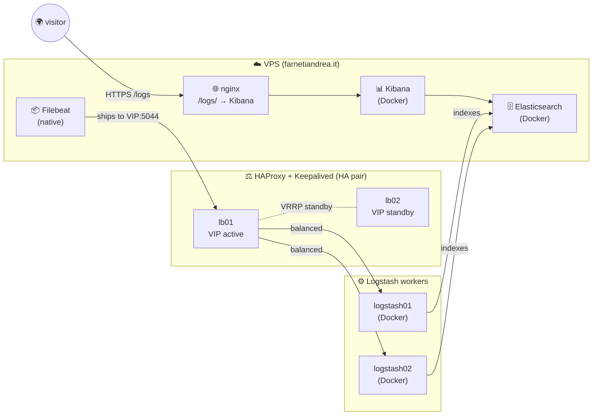

![[Pasted image 20260522152449.png]]

[farnetiandrea.it/logs](https://farnetiandrea.it/logs)

## What is the ELK Stack?

The **ELK Stack** is the open-source ecosystem for centralised logging, maintained by Elastic and the broader community.

The acronym covers three components:
- **E**: **Elasticsearch**: a distributed search engine + document database optimised for logs and time-series text events.
- **L**: **Logstash**: an event-processing pipeline (input → filter → output).
- **K**: **Kibana**: the web UI that queries Elasticsearch and renders dashboards.

In modern deployments a fourth piece is almost always added: **Filebeat**, the lightweight log shipper that lives on every source machine and pushes events into the pipeline. The combination is sometimes called the **Elastic Stack** to underline that Beats are first-class citizens, not an add-on.

***

## Architecture

All traffic between the VPS and the 4 VMs runs on a private LAN: the VMs have no public ports exposed.

### The stack I use

| Role               | Tool                  | Where it runs                   | What it does                                                                          |
| ------------------ | --------------------- | ------------------------------- | ------------------------------------------------------------------------------------- |
| Log shipper        | **Filebeat**          | on the VPS (native)             | reads `/var/log/*`, `journalctl`, Docker logs; ships to the HAProxy VIP on `:5044`    |
| Load-balancing     | **HAProxy + Keepalived** | lb01 + lb02 (HA pair)        | active/standby VIP, TCP-mode load balance to the Logstash pool                        |
| Parsing pipeline   | **Logstash**          | logstash01 + logstash02 (Docker) | parses, enriches, and ships parsed events to Elasticsearch                            |
| Storage + search   | **Elasticsearch**     | on the VPS (Docker)             | indexes events, runs queries, retains data with ILM policy                            |
| Visualisation      | **Kibana**            | on the VPS (Docker)             | UI for Discover / Visualize / Dashboard; exposed publicly via nginx on `/logs/`       |

Why this topology?

Because it mirrors a real, scalable, enterprise pattern for production.

The three layers each solve one specific problem:

- **HAProxy + Keepalived HA pair**: smooths traffic spikes, hides individual Logstash nodes from the shippers, lets you do rolling upgrades / restarts on Logstash without losing events, and isolates failures (a crashed LS doesn't affect Filebeat).
- **Multiple Logstash workers**: parsing is CPU-heavy. Two identical workers double the throughput, and if one dies the load balancer just stops sending events to it.
- **Single Elasticsearch**: this is the only simplification, but it can work fine like this for most cases.

> [!note]
>This series walks the components in **deploy order**, which for a push-based pipeline like ELK runs **opposite to the data flow**: the consumer side has to exist before the producer has anywhere to push to! 

***

## Deployment

Here's the whole deployment (installation + configuration of each component) from start to finish.

### 1. Elasticsearch setup

We start from the **storage** layer: without Elasticsearch nothing downstream has a place to land. 

A single-node container on the VPS, persistent storage on a bind-mounted volume, daily `logs-*` indices rotated by ILM.

First, the host-level prerequisites:
![[elasticsearch-setup#Prerequisites]]

Then the kernel tweak that ElasticSearch requires and the data directory layout:
![[elasticsearch-setup#Kernel settings]]
![[elasticsearch-setup#Directory layout]]

We generate the `elastic` superuser password and write the compose file:
![[elasticsearch-setup#Generate the elastic superuser password]]
![[elasticsearch-setup#docker-compose.yml]]

Bring it up and verify the cluster is online (`yellow` is expected on single-node: replicas can't be allocated):
![[elasticsearch-setup#Start it and verify]]

To close, attach an ILM policy + index template so old `logs-*` indices auto-delete after 14 days:
![[elasticsearch-setup#ILM policy + index template]]

***

### 2. Kibana setup

Now the **UI** layer. 

Kibana runs as a Docker container next to Elasticsearch on the VPS, served publicly under `/logs/` via nginx.

First the prereqs and the credentials Kibana needs (the built-in `kibana_system` service user + the saved-object encryption key):
![[kibana-setup#Prerequisites]]
![[kibana-setup#1. Generate Kibana credentials]]
![[kibana-setup#2. Add the password of kibana_system user in ElasticSearch]]

Then the compose service, and start:
![[kibana-setup#3. Add the Kibana service in docker-compose]]
![[kibana-setup#4. Start Kibana]]

Expose it publicly via nginx and verify the login screen loads:
![[kibana-setup#5. Nginx reverse-proxy at /logs/]]
![[kibana-setup#6. Verify public access]]

And finally create a **Data View** that points Discover at the `logs-*` indices Logstash will populate later:
![[kibana-setup#7. Create a Data View]]

#### Optional: public anonymous viewer

If you want visitors to land directly on Discover without a login (the same flow as `farnetiandrea.it/logs`), layer the [[kibana-viewer-mode|viewer-mode]] on top of the base Kibana deploy. 

The full walkthrough lives on its own page. 

Three moving parts:
- A least-privilege ElasticSearch role
- An `anonymous` ElasticSearch user
- An anonymous auth provider in `kibana.yml`. 

It can be done now or after the rest of the series, doesn't matter.

***

### 3. Logstash setup

Now we add the **parsing** layer. 

Two identical Docker workers (`logstash01` at `10.0.0.21`, `logstash02` at `10.0.0.22`) on dedicated VMs on the private LAN, each writing to the central Elasticsearch with a least-privilege user (`logstash_writer`). 

They're peers, not primary/secondary: running two gives us horizontal capacity and fault isolation.

First the prereqs on each VM:
![[logstash-setup#1. Prerequisites on each VM]]

Then from the VPS, create the dedicated ES user so a compromised worker can only append to `logs-*` and nothing else:
![[logstash-setup#2. Generate the logstash_writer password on the VPS]]
![[logstash-setup#3. Create the ES role and user (on the VPS)]]

On each worker VM, drop the `.env`, the YAML config, the pipeline file, and the compose:
![[logstash-setup#4. Create a .env file on each worker]]
![[logstash-setup#5. config/logstash.yml]]
![[logstash-setup#6. pipeline/main.conf]]
![[logstash-setup#7. docker-compose.yml]]

Bring it up and watch for the "pipeline started" line:
![[logstash-setup#8. Start it]]

And repeat the exact same recipe on the second VM: same image, same `.env`, same pipeline:
![[logstash-setup#9. Repeat on logstash02]]

***

### 4. HAProxy + Keepalived setup

The Logstash workers are up, but Filebeat shouldn't talk to them directly: we want **a single, highly-available endpoint** in front. 

Enter the LB pair: two HAProxy instances on `loglb01` and `loglb02`, sharing a Virtual IP managed by Keepalived. 

#### HAProxy on both LBs

Drop the same config on both `loglb01` and `loglb02`, install and bring up the service:
![[haproxy#1. The configuration file]]
![[haproxy#2. Install and bring it up]]

Then verify the pool from any host on the private LAN (both backends should show `UP`):
![[haproxy#3. Verify the pool]]

#### Keepalived for the VIP

Now we give the pair a shared `10.0.0.10` VIP.

The two configs are nearly identical, with `state MASTER` + `priority 110` on loglb01 and `state BACKUP` + `priority 100` on loglb02:
![[keepalived-vrrp#1. Master config: loglb01]]
![[keepalived-vrrp#2. Backup config: loglb02]]

Install + bring it up on both nodes:
![[keepalived-vrrp#3. Install and bring it up]]

Verify the election (loglb01 wins, owns the VIP) and then test failover by stopping HAProxy on the master, the VIP should migrate to loglb02 within ~5 seconds:
![[keepalived-vrrp#4. Verify election and VIP ownership]]
![[keepalived-vrrp#5. Failover test]]

***

### 5. Filebeat setup

Last step! 

Now that the entire consumer side is up and reachable through the VIP, we install **Filebeat** on the source host (in this lab: the VPS). 

The agent runs natively via `apt`: no container, since shipping logs from a single host has trivial filesystem and journald access requirements.

First the prereqs and install from the official Elastic 8.x APT repo:
![[filebeat-setup#Prerequisites]]
![[filebeat-setup#1. Install Filebeat from the official repo]]

Then the config, pointing `output.logstash` at the HAProxy VIP at `10.0.0.10:5044`:
![[filebeat-setup#2. /etc/filebeat/filebeat.yml]]

Sanity-check the config, then enable and start the service:
![[filebeat-setup#3. Sanity-check the config]]
![[filebeat-setup#4. Enable and start]]

And finally verify end-to-end from Elasticsearch. 

The moment we see `logs-*` indices growing, the entire pipeline is alive:
![[filebeat-setup#5. Verify end-to-end from Elasticsearch]]

And that's it!

We have a complete, scalable ELK stack mirroring the shape used in real production environments: five hosts, six components, end-to-end log pipeline from `journalctl` to Discover. 

Congratulations!

To keep the stack healthy long-term, I leave you with the closing thoughts: ![[filebeat-setup#Final considerations|the Final considerations]]
## What to do next

Great, you've successfully implemented a working log system... but do you have [[my-grafana-stack|a metrics system]] as well?

If the answer is no well, you've got a new project to work on!