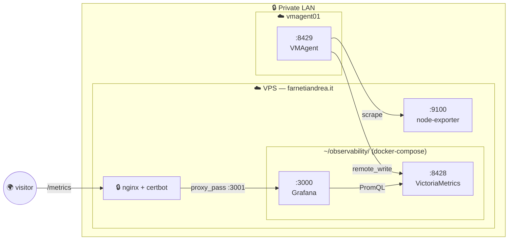

![[Pasted image 20260515145323.png]]
https://farnetiandrea.it/metrics
##  What is the Grafana Stack?

The **Grafana Stack** is the open-source ecosystem of tools maintained by Grafana Labs (and adjacent communities).

Each component in the stack is replaceable: you can put Prometheus where I have VictoriaMetrics, and Grafana will still visualize everything via *datasources*: the stack is famously modular, so pick what you need specifically.

Actually, the Grafana stack can cover every pillar for observability:

- **Metrics**: node-exporter + VMAgent
- **Logs**: Loki + Promtail
- **Traces**: Tempo + OpenTelemetry

But in this wiki, I’ll show you how to use the Grafana stack only for metrics, while using the ELK stack only for logs. The goal is to showcase different technologies commonly used in production environments, including setups where responsibilities are split exactly this way.
 

##  The architecture

The whole stack consists in two machines that are on the same **private LAN**:

- My VPS: I use it for publishing things on my domain, and in this case it is used for publishing **Grafana**, via nginx reverse-proxy with HTTPS.
- A random VM named "vmagent", used to scrape metrics from any other VM I want to monitor.

###  The stack I use

| Role                                                                    | Tool                                                          | Where it runs                      | What it does                                                                                                                                                              |
| ----------------------------------------------------------------------- | ------------------------------------------------------------- | ---------------------------------- | ------------------------------------------------------------------------------------------------------------------------------------------------------------------------- |
| **[Exporter](observability/metrics/node-exporters/_index)**             | [node-exporter](node-exporter.md)                             | on the VPS                         | Sits on `:9100/metrics` and **exposes** numbers about the host (CPU, RAM, disk, net). It doesn't push anywhere — it just makes the data available.                        |
| **[Storage + query](observability/metrics/TSDB/_index)**                | [VictoriaMetrics](observability/metrics/TSDB/victoriametrics) | on the VPS (as a Docker container) | The time-series database. Stores metrics on disk and answers PromQL queries. API-compatible with Prometheus, more efficient in storage and RAM.                           |
| **[Scraper](observability/metrics/scrapers/_index)**                    | [VMAgent](vmagent.md) (VictoriaMetrics Agent)              | on vmagent                         | Periodically **pulls** the `/metrics` page from each target (here: just the VPS node-exporter for now), then forwards the data to the storage backend via `remote_write`. |
| **[Visualization (dashboard)](observability/metrics/dashboard/_index)** | [Grafana](observability/metrics/dashboard/grafana)            | on the VPS (as a Docker container) | The dashboard frontend. Queries VictoriaMetrics, plots graphs, organizes dashboards. Exposed publicly via nginx reverse-proxy at `farnetiandrea.it/metrics`.              |

For deploying your Grafana Stack, we'll follow this order:

1. **[node-exporter](node-exporter.md)** setup on every machine where you need metrics (in my case only my VPS): we have to `curl localhost:9100/metrics` and see the metrics.
2. **[VictoriaMetrics](storage/victoriametrics)** setup only in one dedicated machine (in my case on my VPS as a Docker container): we need to have a empty DB ready to receive data.
3. **[VMAgent](vmagent.md)** setup (on the vmagent VM): it scrapes the metrics from the machines where we installed our node-exporter, and writes them to VictoriaMetrics.
4. **[Grafana](visualization/grafana)** dashboard setup only in one dedicated machine (in my case on my VPS as a Docker container), exposed at `/metrics`.

###  Why this instead of "all in one"?

A single VPS with node-exporter + VMAgent + VictoriaMetrics + Grafana is totally doable and would work for a homelab, but **separating the scraper onto a different host is the realistic pattern** you'll find in any company with more than a couple of servers:

- The scraper (VMAgent) is the only piece that needs network access to every monitored target, so putting it on a *dedicated, minimal* VM makes the security perimeter small and clear.
- Any other machine just needs to expose metrics, so that the scraper can harvest them.

Of course, the VictoriaMetrics database and the Grafana dashboard could also have been separated onto different machines, but that part is relatively trivial to understand.
Actually, if your company uses Kubernetes, there's a dedicated **VictoriaMetrics Operator** that can be used to easily scale the infrastructure, especially the VMAgent scrapers (and much more).

The scraper layer, in fact, becomes essential once you start dealing with infrastructures of 2000+ machines: you **need** multiple dedicated scraper nodes to distribute the workload properly. That’s why I wanted to separate it here as well, to better distinguish its role and to show you how a scalable infrastructure is typically designed.

##  1. Node-exporter setup

Here we are, ready to configure our node-exporter in any VM where we need metrics.

Super simple. 

First thing first, we insall it:

![[node-exporter#1. Installation (Ubuntu/Debian)]]

After the installation, we need to verify everything works:

![[node-exporter#2. Validation]]

And to conclude, we harden everything by binding the service to our private LAN, then we restrict access even more by configuring our firewall accordingly:

![[node-exporter#3. Hardening]]

##  2. VictoriaMetrics setup

Ok so now we are ready to install our TSDB: VictoriaMetrics, the place where we store metrics, and where we do queries via the Grafana GUI dashboard.

For the setup, we follow the very same principles of the node-exporter.

First we insall it:
![[victoriametrics#1. Installation]]

Then we verify the installation:
![[victoriametrics#2. Validation]]

And to conclude, we can do some iptables hardening for Docker (pretty interesting to see):
![[victoriametrics#3. Hardening]]

##  3. VMAgent setup

We are almost there!

VMAgent setup... this is probably the most important piece to look for if you want to scale your setup from a "homelab hobby" to real production.

Why? I suggest to read the full [[vmagent|vmagent page]] if you want to dig just a little bit deeper!

Now, let's start with the installation:

![[vmagent#1. Installation]]

And now it the last thing to do is verify that we did everything right:

![[vmagent#2. Validation]]

If we did... our infrastructure is ready and we can move to the last step!

The data now lives inside the DB, we just need a dashboard to make queries and visualize the results: that GUI is [[grafana|Grafana]].

##  4. Grafana setup

Here we are, last step of this guide, let's do it!

First of all, the Grafana setup:
![[grafana#1. Setup]]

And after the installation, we just need to expose it with our web server, in my case Nginx:

![[grafana#2. Nginx configuration]]

Now we should be able to visit it!

If so, the only thing left to do is the initial configuration:

![[grafana#3. Grafana configuration]]

And that's it!

We have successfully deployed a complete, simple yet solid Grafana stack, congratulations!

The only thing left to do now is personalize it with your dashboards. If you don't know how to do that, I wrote a [[create-dashboards-views|guide]] to help you take your first steps with Grafana. 

Check it out and start monitoring!
