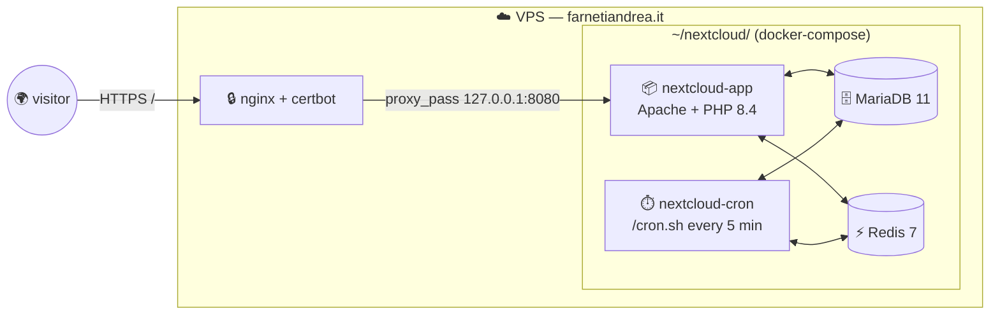

![[Pasted image 20260706181240.png]]
[files.farnetiandrea.it](https://files.farnetiandrea.it)

## What is Nextcloud?

**Nextcloud** is the open-source, self-hosted alternative to Dropbox, Google Drive and Microsoft OneDrive: file sync between devices, sharing links, a web UI to browse and preview, and — if you enable the extra apps — calendar, contacts, notes, video calls, an office suite, and a whole ecosystem of plugins.

It's a monolithic PHP application, but around it you always need three supporting pieces:

- A **database** (MariaDB or PostgreSQL): stores metadata, users, sharing rules. SQLite works for one user but starts to hurt as soon as two things want to talk to it at the same time.
- A **cache + lock coordinator** (Redis): coordinates file locks across worker processes, holds distributed cache and PHP sessions.
- A **reverse proxy** (nginx or Apache): terminates TLS, buffers large uploads, forwards the right headers.

Put together, that quartet is what we'll call *the Nextcloud stack*.

***

## Architecture

For this one, the whole thing lives on **one VPS** — the same one that already runs my [[my-elk-stack|logs]] and [[my-grafana-stack|metrics]] stacks. No private LAN this time: single host, one Docker Compose file, four containers, and the host nginx sitting in front.



The important trick is how the container binds its port: `127.0.0.1:8080` and **not** `0.0.0.0:8080`. That way the Nextcloud container is invisible from outside the VPS — the only public entrypoint is the host nginx, which terminates TLS with a Let's Encrypt cert and reverse-proxies to the container. Same shape I use for Grafana and Kibana on this same VPS, so nothing new at the ingress layer.

### The stack I use

| Role                      | Tool                          | Where it runs                                | What it does                                                                                                        |
| ------------------------- | ----------------------------- | -------------------------------------------- | ------------------------------------------------------------------------------------------------------------------- |
| **Application**           | Nextcloud (`stable-apache`)   | on the VPS (as a Docker container)           | The Nextcloud web app: Apache + PHP-FPM in a single container, listens on `127.0.0.1:8080`.                        |
| **Database**              | MariaDB 11                    | on the VPS (as a Docker container)           | Stores users, shares, file metadata, activity log. Persistent on a bind-mounted volume.                             |
| **Cache + file locking**  | Redis 7                       | on the VPS (as a Docker container)           | Distributed cache, file locking and PHP sessions. Shared between the app and the cron worker.                       |
| **Background jobs**       | Nextcloud (`stable-apache`)   | on the VPS, same image, `/cron.sh` entrypoint | Runs periodic maintenance every 5 minutes: file scan, notifications, cleanup, share expiry.                        |
| **Reverse proxy + TLS**   | nginx + certbot               | on the VPS (native, on the host)             | Terminates HTTPS at `files.farnetiandrea.it`, adds security headers, forwards to the container.                     |

For deploying your Nextcloud stack, we'll follow this order:

1. **DNS**: point a subdomain of yours at your VPS.
2. **Reverse proxy + TLS**: nginx vhost + Let's Encrypt cert, so we can reach the app over HTTPS.
3. **The Docker Compose stack**: bring up Nextcloud, MariaDB, Redis and the cron worker in one shot.
4. **Post-install tuning**: a handful of `occ` commands to turn a first-boot install into something production-grade.
5. **First login**: with the one rescue trick that saves you an hour of head-scratching.

Why one host and not two (or three)?

Because for a personal file-transfer cloud, splitting the database or Redis onto their own VMs is pure ceremony: no throughput to gain, more failure domains, more things to keep patched. The scaling moves that actually pay off for Nextcloud — external object store for user data, primary-replica DB, dedicated Redis Sentinel — only start being worth their weight past ~50 concurrent users. If that's the scale you're at, you probably don't need this guide anyway.

***

## Deployment

Here's the whole deployment, start to finish.

### 1. DNS

Point a subdomain at your VPS. I chose `files.` because it says what the service *does* rather than *which app runs there* — if I ever swap Nextcloud for Seafile or something else, the name still fits.

```
files.<your-domain>   A   <YOUR_VPS_IP>   TTL 300
```

Verify from any machine:

```bash
dig +short files.<your-domain>
```

You should see your VPS IP.

***

### 2. Reverse proxy + TLS

Same pattern as [[my-elk-stack|Kibana]] and [[my-grafana-stack|Grafana]]: a vhost on the host nginx, TLS from certbot, reverse-proxy to the container.

Two-step vhost setup: an HTTP-only *bootstrap* version so certbot can pass the ACME challenge, then the full *production* version with reverse proxy.

First, the bootstrap:

```nginx
# /etc/nginx/sites-available/files.<your-domain>  (bootstrap)
server {
    listen 80;
    server_name files.<your-domain>;

    location /.well-known/acme-challenge/ { root /var/www/certbot; }
    location / { return 404; }
}
```

Enable it, reload nginx, then have certbot issue the cert:

```bash
sudo ln -sf /etc/nginx/sites-available/files.<your-domain> /etc/nginx/sites-enabled/
sudo nginx -t && sudo systemctl reload nginx
sudo certbot --nginx -d files.<your-domain>
```

Now swap in the production vhost:

```nginx
# /etc/nginx/sites-available/files.<your-domain>  (production)
server {
    listen 80;
    server_name files.<your-domain>;
    return 301 https://$host$request_uri;
}

server {
    listen 443 ssl http2;
    server_name files.<your-domain>;

    ssl_certificate     /etc/letsencrypt/live/files.<your-domain>/fullchain.pem;
    ssl_certificate_key /etc/letsencrypt/live/files.<your-domain>/privkey.pem;
    include /etc/letsencrypt/options-ssl-nginx.conf;
    ssl_dhparam /etc/letsencrypt/ssl-dhparams.pem;

    # Security headers Nextcloud recommends
    add_header Strict-Transport-Security "max-age=15552000; includeSubDomains" always;
    add_header X-Content-Type-Options "nosniff" always;
    add_header Referrer-Policy "no-referrer" always;
    add_header X-Frame-Options "SAMEORIGIN" always;
    add_header X-Robots-Tag "noindex, nofollow" always;

    client_max_body_size 10G;
    client_body_timeout 300s;

    # Nice URLs that Nextcloud clients expect
    location = /.well-known/carddav   { return 301 /remote.php/dav/; }
    location = /.well-known/caldav    { return 301 /remote.php/dav/; }
    location = /.well-known/webfinger { return 301 /index.php/.well-known/webfinger; }
    location = /.well-known/nodeinfo  { return 301 /index.php/.well-known/nodeinfo; }

    location / {
        proxy_pass http://127.0.0.1:8080;
        proxy_set_header Host              $host;
        proxy_set_header X-Real-IP         $remote_addr;
        proxy_set_header X-Forwarded-For   $proxy_add_x_forwarded_for;
        proxy_set_header X-Forwarded-Proto https;
        proxy_request_buffering off;
        proxy_buffering off;
    }
}
```

Reload and the ingress side is done:

```bash
sudo nginx -t && sudo systemctl reload nginx
```

***

### 3. The Docker Compose stack

Now the fun part. Four services in one Compose file: the Nextcloud app (Apache + PHP), MariaDB, Redis and the cron worker.

The whole thing lives at `~/nextcloud/`. Two files.

**`.env`** — secrets, `chmod 600`:

```dotenv
DB_ROOT_PASSWORD=<random 32 chars>
DB_PASSWORD=<random 32 chars>
ADMIN_USER=admin
ADMIN_PASSWORD=<random 20 chars>
```

Generate the random values with `openssl rand -base64 32 | tr -d '\n=/+' | head -c 32`. Don't commit this file — add it to `.gitignore` alongside `db-data/` and `nextcloud-app/`.

**`docker-compose.yml`**:

```yaml
services:
  db:
    image: mariadb:11
    container_name: nextcloud-db
    restart: unless-stopped
    command: --transaction-isolation=READ-COMMITTED --log-bin=binlog --binlog-format=ROW
    volumes: [ ./db-data:/var/lib/mysql ]
    environment:
      MARIADB_ROOT_PASSWORD: ${DB_ROOT_PASSWORD}
      MARIADB_DATABASE: nextcloud
      MARIADB_USER: nextcloud
      MARIADB_PASSWORD: ${DB_PASSWORD}
    healthcheck:
      test: ["CMD","healthcheck.sh","--connect","--innodb_initialized"]
      interval: 30s
      timeout: 10s
      retries: 5

  redis:
    image: redis:7-alpine
    container_name: nextcloud-redis
    restart: unless-stopped
    command: redis-server --save 60 1 --loglevel warning

  app:
    image: nextcloud:stable-apache
    container_name: nextcloud-app
    restart: unless-stopped
    depends_on:
      db:    { condition: service_healthy }
      redis: { condition: service_started }
    ports: [ "127.0.0.1:8080:80" ]
    volumes: [ ./nextcloud-app:/var/www/html ]
    environment:
      MYSQL_HOST: db
      MYSQL_DATABASE: nextcloud
      MYSQL_USER: nextcloud
      MYSQL_PASSWORD: ${DB_PASSWORD}
      REDIS_HOST: redis
      NEXTCLOUD_ADMIN_USER: ${ADMIN_USER}
      NEXTCLOUD_ADMIN_PASSWORD: ${ADMIN_PASSWORD}
      NEXTCLOUD_TRUSTED_DOMAINS: files.<your-domain>
      TRUSTED_PROXIES: 172.16.0.0/12
      OVERWRITEHOST: files.<your-domain>
      OVERWRITEPROTOCOL: https

  cron:
    image: nextcloud:stable-apache
    container_name: nextcloud-cron
    restart: unless-stopped
    depends_on:
      db: { condition: service_healthy }
    volumes: [ ./nextcloud-app:/var/www/html ]
    entrypoint: /cron.sh

networks:
  default:
    name: nextcloud
```

Bring it up and watch the first-run install:

```bash
cd ~/nextcloud
docker compose up -d
docker compose logs -f app        # ~30 s
```

You want the log to settle on the Apache banner (`Command line: 'apache2 -D FOREGROUND'`) with no more `Initializing Nextcloud`. Sanity-check via the status endpoint:

```bash
curl -s https://files.<your-domain>/status.php | jq
# → {"installed":true,"maintenance":false, ...}
```

***

### 4. Post-install tuning

Six `occ` commands, straight into the app container. This is what turns a fresh install into something you'd actually want to rely on:

```bash
# add the DB indices that first-run install skips
docker compose exec -u www-data app php occ db:add-missing-indices

# support files bigger than 4 GB
docker compose exec -u www-data app php occ db:convert-filecache-bigint --no-interaction

# wire Redis as distributed cache + file locking (app and cron have to agree)
docker compose exec -u www-data app php occ config:system:set memcache.distributed --value='\OC\Memcache\Redis'
docker compose exec -u www-data app php occ config:system:set memcache.locking     --value='\OC\Memcache\Redis'
docker compose exec -u www-data app php occ config:system:set redis host --value=redis
docker compose exec -u www-data app php occ config:system:set redis port --value=6379 --type=integer

# background jobs → cron (the container we already deployed)
docker compose exec -u www-data app php occ background:cron

# soft per-user quota — a runaway upload can't fill /
docker compose exec -u www-data app php occ config:app:set files default_quota --value "10 GB"

# and the built-in health check
docker compose exec -u www-data app php occ setupchecks | grep -v '✓'
```

The last line should print only `ℹ` (informational) lines. Anything red is real.

***

### 5. First login (and the one rescue trick)

Point your browser at `https://files.<your-domain>` and log in with the credentials from `.env`.

Now — this bit surprised me the first time, so I'll spare you the debugging.

On some `stable-apache` builds, `NEXTCLOUD_ADMIN_PASSWORD` from the env doesn't fully take. The DB user gets created, WebDAV Basic Auth accepts the password, but the browser login form keeps saying *Wrong login or password*. Worse: every failed attempt writes `set-cookie: nc_username=deleted; …` to your browser, and the browser keeps sending them. From that point on, even the correct password bounces off the form.

The 20-second rescue is a three-step ritual:

```bash
# 1. Flush Redis — nukes the poisoned session state on the server
docker compose exec -T redis redis-cli FLUSHALL

# 2. Reset the admin password via occ
NEW_PW='ChangeMeToday!'   # 12+ chars, mixed case, digit, special
OC_PASS="$NEW_PW" docker compose exec -T -e OC_PASS -u www-data app \
  php occ user:resetpassword --password-from-env admin

# 3. Verify from the outside — should return 200
curl -s -o /dev/null -w '%{http_code}\n' -u "admin:$NEW_PW" \
     https://files.<your-domain>/remote.php/dav/files/admin/
```

And the important last step: **open an incognito window** for the actual login. The tainted cookies live in your browser cache too, not just on the server — a normal reload still carries them, and the login form still bounces. Incognito ignores them, and you're in.

Once you're logged in, change the password from *Settings → Security* to something you'll actually remember, and enable 2FA while you're there.

***

And that's it!

We've got a complete private Nextcloud instance running behind our own domain: TLS, distributed caching, background jobs, sane quotas. Congratulations!
